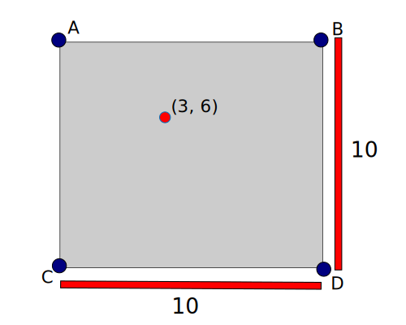
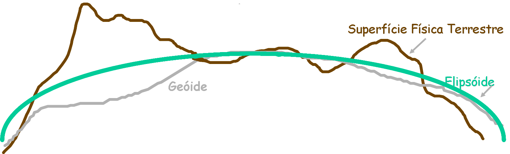
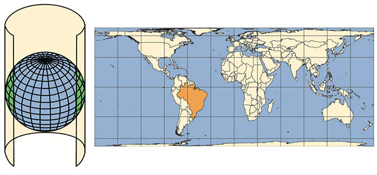
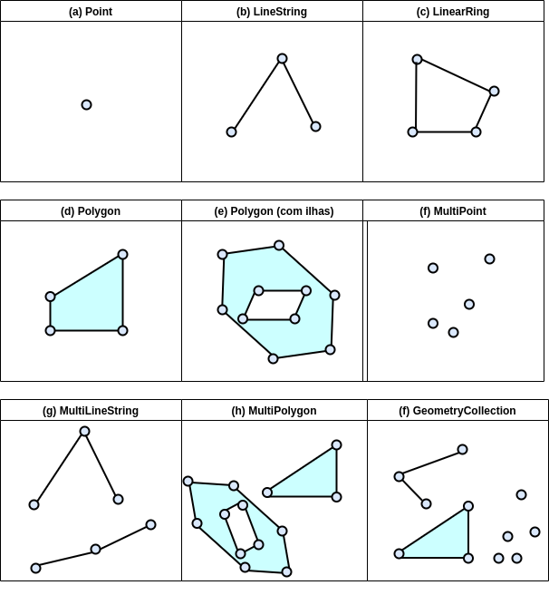
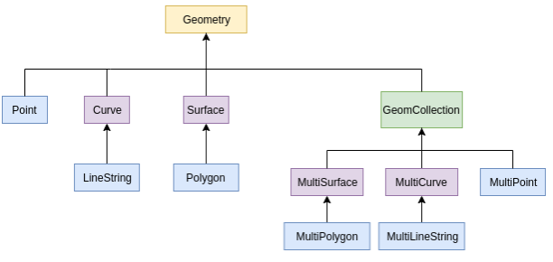
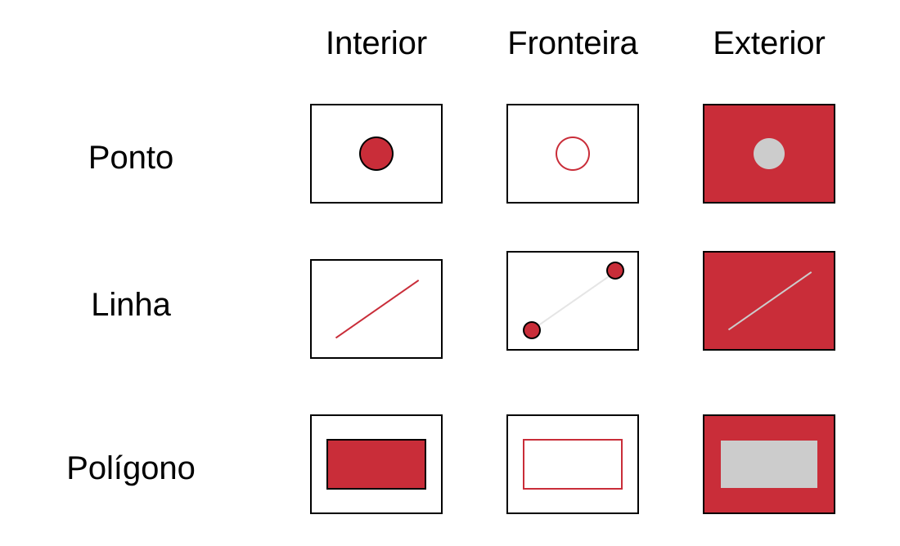
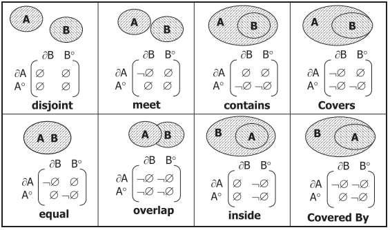
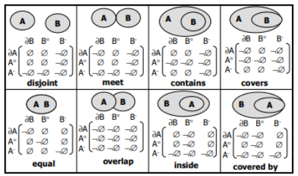

# Introdução `r emo::ji("world")`

## Representações de dados espaciais

Dentro do universo estrutural dos SIGs (Sistema de Informação Geográficas), a forma de representação dos dados geográficos podem ser divididas em duas grandes classes: vetoriais e matriciais. Sendo que as estruturas de dados vetoriais são representações que denotam as fronteiras de entidades geográficas, ou seja, através de suas características é possível descrever computacionalmente as formas de uma superfície. Já a classe matricial, representa informações estruturadas em forma de matriz (linhas e colunas). Cada elemento dessa matriz é formado por um determinado valor associado a sua localização e formalmente pode ser representado como uma matriz P(m,n) composto de m colunas e n linhas. Contudo a representação dos dados espaciais é composto por uma gama de grupos pertencentes às representações vetoriais e matriciais, de tal forma que cada grupo deve ser explorado e suas  particularidades aprofundadas separadamente.

### Vetoriais

A estrutura de dados espaciais no formato vetorial é utilizada para representar a fronteira de uma entidade geográfica, sendo que suas coordenadas espaciais são os pontos que descrevem a posição e direção de um objeto.  Para a classe de estruturas vetoriais suas entidades básicas (Figura \@ref(fig:fig1h1)) são representadas nas formas de pontos, linhas e polígonos.

```{r fig1h1, echo=FALSE ,fig.align="center",fig.cap='Representação no plano unidimensional das formas vetoriais.'}
  
```

Um **ponto** tem como finalidade a identificação ou localização de uma ocorrência no espaço, onde um par ordenado (x,y) de coordenadas é utilizado para identificar sua posição geográfica, um dos exemplos para representação de pontos pode ser exemplificado como a  localização do ponto central de uma cidade ou localidade. Uma **linha** é composta por um conjunto de pontos e representa uma estrutura unidimensional no espaço, é bastante utilizada para representação de rios e estradas. Um **polígono** *“é a região do plano limitada por uma ou mais linhas poligonais conectadas de tal forma que o último ponto de uma linha seja idêntico ao primeiro da próxima”* @casanova2005banco.


### Matriciais

Diferente das representações vetoriais, onde cada fenômeno é apresentado como um objeto espacial, nas estruturas matriciais (**raster**) os atributos presentes nos fenômenos estão associados a elementos em uma matriz. Cada valor armazenado na estrutura matricial têm suas características relacionadas a uma posição, essa posição também é chamada de célula, e é responsável por armazenar um valores que representam uma área específica da superfície.

Uma das características presentes nas estruturas matriciais é a resolução espacial que corresponde a um valor relacionado a dimensionalidade linear em um espaço geográfico. *“Quanto menor a dimensão das células, maior a resolução da imagem matricial e, consequente, maior a quantidade de memória necessária para armazená-la”* @lisboa2001modelagem.

```{r fig2h2, echo=FALSE ,fig.align="center",fig.cap='Estrutura para representação matricial onde cada célula tem um valor de atributo (UM ou ZERO)'}
  
```

A representação matricial pressupõe que o espaço amostral dos elementos que compõem uma superfície plana tenham um valor de atributo associado, ou seja, cada célula está contém um valor e uma localização (linha e coluna) da matriz. Além da representação simples, é possível generalizar que os espaços celulares podem estar associados a mais de um atributo, ou seja, uma quantidade maior de fenômenos está associada a uma localização da matriz, essa associação pode ser do tipo espaço-temporal para retratar fenômenos dentro de uma série temporal, esta forma de representação é muito conveniente para armazenar os dados no formato de bancos de dados do tipo objeto-relação.

## Sistema de referência espacial

Bem, como vimos até aqui, dados espaciais possuem duas características fundamentais, o registro de diferentes fenômenos e sua localização. Mas como esta localização é vinculada a uma posição da superfície terrestre?

Para conseguirmos responder a esta pergunta devemos ir por partes. Vamos começar imaginando uma superfície plana, como a apresentada abaixo.

<center>

</center>

Agora perceba que, para gerar tal superfície o que precisou ser feito foi delimitar quatro pontos e então ligar cada um deles, veja.

<center>

</center>

Até aqui apenas criamos uma superfície e delimitamos seu espaço através dos pontos *ABCD*, vamos agora inserir valores para os lados desta superfície.

> Lembre-se que, está superfície representa um quadrado, e assim, todos os seus lados têm o mesmo tamanho.

<center>

</center>

Certo! Com os limites definidos podemos agora adicionar um ponto nesta superfície, isto porque, se cada um dos lados vai de 0 a 10, conseguimos facilmente inserir um ponto utilizando os lados como referência.

<center>

</center>

Ok, mas, o que é isso tem a ver com sistemas de referência espacial e nossa pergunta inicial? Tudo! Isto já que, para sabermos onde estava o ponto e sua localização precisamos definir os limites da superfície, e a mesma situação é necessária para os dados espaciais e a superfície terrestre.

Então, com a mesma lógica aplicada a superfície quadrada do exemplo anterior podemos mapear todo o planeta Terra, porém alguns problemas surgem para este caso. Primeiro, para começarmos a mapear a superfície terrestre devemos entender:

* Como é a superfície terrestre; e
* formas de representação.

Começando com a superfície terrestre, as ciências geodésicas, que se empenham em realizar os estudos das formas e dimensões da Terra dividem sua superfície em três formas diferentes [@rafaelmontanari2014].

<center>

</center>

Na Figura acima o geóide representa tudo que está no nível do mar, o elipsoide representa a camada abaixo do geóide e o terreno a parte superior ao geóide, além disto, tanto a representação da superfície terrestre quanto o geóide carregam diversas dificuldades quando precisam ser representados, por conta de suas características irregulares, por isto, adota-se como representação da superfície, o elipsoide.

> Com isto, pode-se concluir que, o geóide é a superfície de medição da Terra, enquanto o elipsoide é a superfície de representação.

Certo, com a definição da forma de representação da superfície terrestre já podemos realizar todo o mapeamento, correto? Ainda não, pois além de entendermos como é a superfície precisamos definir como toda esta superfície terrestre será representada. Tal representação pode ser feita de diversas formas, a variar de acordo com a necessidade, algumas dessas formas são apresentadas na Figura abaixo.


Onde, a superfície esférica normalmente é utilizada como representação da Terra quando há grandes quantidades de área a serem representadas, como por exemplo, diversos continentes ou mesmo o planeta todo [@rafaelmontanari2014] . Já para os casos, onde é necessário a representação de uma quantidade de Terra considerável, porém, não tão grande como o planeta todo, utiliza-se a representação elipsóidica [@rafaelmontanari2014], esta que inclusive é a mais utilizada nas aplicações espaciais atuais. Por fim, tem-se o modelo geoidal, que como já citado, é o que mais se aproxima da superfície terrestre, porém sua representação pode ser muito complexa para o mapeamento da superfície terrestre e a geração das localizações.

Beleza! Agora entendemos todo o fluxo necessário para realizar do mapeamento, partindo da definição da superfície e indo até suas formas de representação. Com isto, conseguimos fazer uma definição de sistemas de referência espacial que seja clara e concisa.

> Sistemas de referência espacial, ou DATUM, é um sistema coordenado, utilizado para representar características físicas e geométricas do planeta Terra.

Alguns exemplos de sistemas de referência espacial são:

* WGS 84;
* Sirgas 2000.

Muito interessante, porém, mesmo com este entendimento ficou uma dúvida, como é que os pontos vão ser representados, da mesma forma que havíamos feito no exemplo? Bem, esta pergunta é respondida nas seções seguintes.

## Projeções cartográficas

Até esta seção, todas as informações passadas de representações da superfície terrestre utilizaram modelos tridimensionais para tal feito, porém, se estas representações possuem três dimensões, como mapas bidimensionais, com o apresentado abaixo são gerados?

<br>

<center>

</center>

<br>

A resposta é simples! `Projeções cartográficas`, estas que através de transformações geométricas realizam a conversão das representações tridimensionais para bidimensionais, mantendo a correspondência entre ambas @ibge2016.

### Tipos de projeção

Por se tratar de operações geométricas é esperado que nessas existam distorções [@ibge2016], por conta disto existem diferentes tipos de superfícies geométricas de projeção que são utilizadas [@ibge2016cartog], para que as superfícies no momento da projeção foram a menor quantidade possível de distorções nas áreas de interesse.

As subseções a seguir apresentam alguns tipos de superfícies geométricas utilizadas para as projeções.

#### Projeção cilíndrica

Na projeção cilíndrica o esferoide de representação da Terra é envolvido sobre um cilindro tangente.

<br>
<center>

</center>
<br>

Neste tipo de projeção há muitas distorções dos polos, sul e norte, o que faz com que estes pareçam ter tamanhos bem maiores do que deveriam.

#### Projeção Cônica

As projeções cônicas são geradas através da utilização de um cone, que favorece a redução de distorções nos meridianos e aumenta a distorção nos polos.

<br>
<center>

</center>
<br>

#### Projeção plana

Projeção que é gerada com base em um plano, que toca em um ponto específico da representação da esfera terrestre. 

<br>
<center>

</center>
<br>

Como é possível perceber na Figura acima, neste tipo de projeção é esperado que haja muitas distorções no entorno do ponto utilizado como referência para sua criação.

## Sistema de Coordenadas 

Bem, mesmo com as várias formas de representação e projeção, é mais que necessário utilizamos de alguma técnica que nos permita, dentro de cada uma das representações, apontar sem nenhum tipo de ambiguidade as posições nas quais diferentes objetos estão na superfície terrestre.

### Sistemas de Coordenadas Geográficas

Então, para que cada objeto na superfície da Terra fosse facilmente identificado, sem nenhum tipo de ambiguidade, um sistema de linhas imaginárias, nomeado de Sistemas de Coordenadas Geográficas foi criado. Neste sistema existem dois tipos de linhas, os meridianos e os paralelos. Para os meridianos tem-se que são linhas imaginárias que cortam a Terra no sentido norte-sul e para os paralelos, tem-se linhas que circulam a Terra no sentido leste-oeste [@ibge2016cartog]. 

Vale acrescentar também que, os paralelos nos representam as latitudes, que são a distância em graus da linha do Equador até um determinado paralelo. Os valores da latitude podem variar de 0° (Sob a linha do Equador) a 90° (Sob as extremidades), sendo que, para os hemisférios norte são considerados valores positivos e para o hemisfério sul valores negativos. Já as longitudes representam a distância, em graus, entre o meridiano de Greenwich até um outro meridiano qualquer. Seus valores variam de 0° (Sob o meridiano de Greenwich) a 180° (Nas extremidades leste e oeste a Greenwich), onde, para o leste consideram-se valores positivos e ao oeste valores negativos [@ibge2016cartog].

A representação de todo este sistema imaginário de linhas pode ser visto na Figura abaixo.

<br>
<center>

</center>
<br>

### Coordenadas planas

Outra forma de realizar o mapeamento das posições das representações das superfícies terrestres é feita com o método nomeado de Coordenadas planas, que de acordo com @alexandrerosadossantos2016 são recomendados para atividades de medições de áreas e distâncias.

O sistema de coordenadas planas é baseado no sistema cartesiano de representação, onde em um plano bidimensional o cruzamento de duas linhas faz a representação da localização de um ponto [@alexandrerosadossantos2016], sendo que o eixo X representa a Latitude e o eixo Y a longitude.

Espere um pouco, representação em um plano? Até aqui vimos a representação geográfica que é feita sobre a representação esferoidal da superfície terrestre e só vimos a superfície plana nas projeções. Pois bem, para a utilização do sistema de coordenadas planas é assumido que alguma projeção seja aplicada, normalmente utiliza-se a superfície cônica na projeção dos dados para a utilização deste sistema [@alexandrerosadossantos2016].

Lembra do mercator que citamos anteriormente, a forma de representação para coordenadas planas comumente utilizada também é dele, e possui o nome de `Sistema Universal Transversa de Mercator`.


### Códigos EPSG

Os códigos **E**uropean **P**etrolem **S**urvey **G**roup (EPSG) representam uma forma de organização dos mais diversos sistemas de referências e seus sistemas de coordenadas, desta forma os códigos EPSG criam uma forma rápida e simples para a busca e identificação de qual sistema de referência e sistema de coordenadas está sendo utilizado.

Como estes códigos abrangem todos os sistemas de coordenadas do mundo, com os mais variados sistemas de coordenadas, abaixo é apresentado uma tabela com somente alguns dos códigos EPSG mais utilizados no Brasil.


| CÓDIGO EPSG | PROJEÇÃO/DATUM |
|:-----------:|:--------------:|
|     4225    |       GCS      |
|     4618    | Corrego Alegre |
|     4674    |    GCS SAD69   |
|     4326    |   GCS SIRGAS   |
|    22521    |      2000      |
|    22522    |    GCS WGS84   |
|    22523    |     Corrego    |

## Open Geospatial Consortium (OGC)

A organização *Open Geospatial Consortium* (Consórcio Geoespacial Aberto, OGC) é responsável por reunir organizações voluntárias que trabalham no desenvolvimento e implementação de padrões geométricos para o processamento de dados em um SIG. O OGC propõem dentro de suas normas que para dados espaciais existem dois tipos a serem descritos na sua forma simples, **geometry** (geometria) e **geography** (geografia) que oferecem suporte a outros dezesseis objetos (ou instâncias) derivados, porém apenas onze podem ser instanciados diretamente. Os modelos de objetos geométricos do OGC possuem características que podem ser descritas dentro do seu conjunto de normas e implementações, essas características fazem parte da arquitetura que descreve objetos comuns chamado *Simple Features*. Para descrever a hierarquia **geometry**  onde os tipos de dados são baseados, é possível criar instâncias que representam os tipos de dados geográficos, para isso a figura ilustra os principais tipos de dados para **geometry** e **geography**.

```{r fig142, echo=FALSE ,fig.align="center", out.width = "70%",fig.cap='Matriz de 9-Interseções relacionando duas regiões entre objetos - Fonte: [@egenhofer1991point]'}
  
```

Os tipos de dados espaciais dentro do OGC *Simple Features* (Figura  \@ref(fig:fig142)) estão divididos em dezesseis tipos de diferentes instâncias, podendo ser divididos em outros três grupos: **Primitivos**, **Múltiplos** e **Coleções**.  No tipo **primitivo** temos os seguintes objetos:

- Ponto (POINT): Um ponto é um objeto 0-dimensional que representa uma localização simples para coordenadas espaciais, sendo composto por um par ordenado de coordenadas (x,y) associados a um sistema de referências espaciais.

- Linha (LINESTRING): É composto por um conjunto de pontos interpolados linearmente onde cada par consecutivo de pontos define um segmento de linha, ou seja um LINESTRING é exatamente a interpolação entre dois pontos ou um conjunto de pontos.

- Polígono (POLYGON): O polígono é definido como uma superfície planar  com fronteira exterior e zero ou mais superfícies interiores. Para compor um polígono é necessário que um conjunto de 3 ou mais pontos distintos para formar os vértices do mesmo. 

Já para o grupo dos **Múltiplos**, os tipos de dados relacionados são baseados na coleção dos tipos simples, ou seja, para um MULTIPOINT basta que um conjunto de pontos esteja associado com zero o mais instâncias; Já para MULTILINESTRING o mesmo é aplicado, sendo que o conceito de MULTICURVE múltiplas curvas entre pontos é o que define a coleção de objetos associados, além disso o MultiLineString pode ser do tipo simples, fechada ou não fechada; Já o MULTIPOLYGON pode ser definido como parte de uma superfície bi-dimensional dentro do GeomCollection, onde os elementos são formados por um conjunto de polígonos adjacentes. 

```{r fig42h1, echo=FALSE ,out.width="70%",fig.align="center",fig.cap='Hierarquia da OGC Simple Feature simplificada'}
  
```


Existe uma diferença significativa para os tipos de dados de **geometry** e **geography**, os dois se comportam de maneira semelhante porém algumas diferenças importantes devem ser levadas em consideração. Existem tipos de medidas para dados espaciais, dentre estes tipos de medidas podemos destacar as medidas de sistema planar (terra plana) e os sistemas elipsoidal (terra redonda), onde as medidas de distância e áreas possuem variações que devem ser levadas em consideração para obtenção de medidas mais precisas. Assim como as medidas para os dados espaciais é importante determinar a orientação dos dados espaciais, em sistemas planares a orientação do anel do polígono não é um fator importante, já para sistemas elipsoidais um polígono pode ter valores ambíguos caso a sua orientação não seja definida.

## Tipos e operações espaciais

## Relacionamentos espaciais nomeados

Realizar a caracterização do relacionamento entre os objetos espaciais permite a criação de contextos semânticos sobre estes [@Camara2005] e assim seja possível a extração de informações relevantes [@Ferreira2010].

É tido que, existem alguns tipos de relacionamentos entre os objetos que podem ser utilizados para tal caracterização, sendo eles, topológicos, métricos e de ordem [@Camara2005]. Os relacionamentos métricos representam relações que tratam especificamente de área de distância entre objetos. Já os de ordem representam a forma com que um objeto está disposto ao outro. Os topográficos consideram os relacionamentos de interseção entre os objetos.

Todos os tipos citados anteriormente serão tratados em algum momento durante esta documentação, porém nesta seção as relações topográficas terão uma enfase especial, isto já que, diferente das demais, apresenta uma estrutura própria para seus relacionamentos e ainda, segundo @Bogorny2001, representa a forma de relação espacial mais utilizada, já que esta faz analogias diretas a como percebemos a espacialidade do mundo real.

<!-- 
http://sertie.fct.unesp.br/wp-content/uploads/2017/10/17-Relacionamentos-topol%C3%B3gicos.pdf
-->
Desta forma, as subseções abaixo apresentam um pouco mais sobre os relacionamentos topográficos, também denominados de relacionamentos espaciais nomeados, uma vez que, possuem uma definição formal, que vai desde sua nomenclatura até as formas de representação.

### Relacionamentos espaciais

Esta subseção busca de forma simples, apresentar a definição formal dos relacionamentos espaciais nomeados. Em um segundo momento, na documentação do Python, R e PostGIS deste material há exemplos de aplicações de tais relacionamentos.

Para o entendimento destes relacionamentos, vamos começar fazendo a definição das regiões das geometrias, assunto base para o entendimento das formas de relação, para isto, veja a Figura abaixo.

<center>

</center>

Perceba que, para cada uma das principais geometrias há um conjunto de três definições. O interior refere-se diretamente a área interna da geometria, enquanto que a fronteira representa somente o contorno da área e o exterior sendo toda área que não é preenchida pela geometria.

Certo, vejamos agora, alguns tipos de relacionamentos espaciais:

- contains - Verifica se a geométria B contêm A;
- equal - Verifica se duas geométrias são iguais.

Porém, somente ao ler a descrição de cada um dos métodos de relacionamentos apresentados acima é possível perceber um problema. O que significa dizer que a geometria B contém A ? Ou mesmo, o que torna as geometrias iguais ?

Por conta destas questões que cada um destes métodos possui uma definição formal, que como citado anteriormente, evita qualquer tipo de múltiplas interpretações, mas como esta definição pode ser feita ? Para este problema @Bogorny2001 indica que diversas abordagens podem ser aplicadas, porém é comum a aplicação de matrizes de interseção, descrevendo o comportamento de cada região da geometria nos métodos de relacionamento.

@Camara2005 define que para casos simples pode ser utilizada a chamada Matriz de 4-Interseções, que define 8 relações espaciais nomeadas e descreve o que cada uma dessas operações leva em consideração. A Matriz de operações é apresentada abaixo.

```{r figm4, echo=FALSE ,fig.align="center", out.width = "50%",fig.cap='Matriz 4-Interseções Fronteira (∂); interior (°); exterior (-); vazio (∅); não vazio (¬∅)  - Fonte: @egenhofermdifelicepclementinie1994'}
  
```

O ponto importante da Figura apresentada acima é que, para cada um dos métodos que estão sendo apresentados, há exatamente o que ele considera, por exemplo, vejamos o método **contains**, que indica se uma geometria está ou não contida em outra. Neste método existem quatro cenários possíveis. No primeiro, é considerado se as fronteiras (∂) estão se cruzando, e caso estejam não é considerado que uma contém a outra. O segundo caso verifica se o interior (°) de uma geometria está em outro, e caso esteja é considerado que uma está contida em outra. 

Veja que interessante! Através de uma definição simples e direta já foi possível perceber os possíveis casos de cada método.

Há casos em que a Matriz de 4-Interseções não é o suficiente para fazer as representações [@Camara2005], para estes casos outros modelos podem ser utilizados, como é o caso da Matriz de 9-Interseções Dimensionalmente estendidas, apresentada na seção seguinte a esta.

### Restrições espaciais

Em certos casos, o fenômeno que está sendo representado pelos dados espaciais faz com que sejam necessários a aplicação de regras e restrições específicas sobre os mesmos [@Bogorny2001]. Esta regra também é aplicável no contexto dos relacionamentos espaciais.

Por exemplo, o método **disjoint** pode ser aplicado considerando qualquer par de geometrias, enquanto que o método **overleap** só pode ser aplicado a pares do mesmo tipo, como por exemplo geometrias de linhas com outras linhas [@Camara2005].

Caso você fique interessado e deseja uma descrição completa de todas estas restrições, não deixe de consultar o material de `Banco de dados geográficos`, disponibilizado pelo INPE.

## Matriz de 9-Interseções Estendida dimensionalmente

O modelo de novo intersecções dimensionalmente estendido (**DE9IM**) tem como objetivo apresentar um método para os relacionamentos topológicos entre objetos geométricos, este modelo considera o resultado da interseção entre as fronteiras, interiores e exteriores de duas geometrias [@queiroz2005banco]. A DE9IM é uma extensão da matriz de 4-interseções onde oito relações topológicas binárias são consideradas, estas operações representam a interseção entre as fronteiras e o interior de duas geometrias [@egenhofer1990categorizing].

A definição dos relacionamentos topológicos para a **DE9IM** visa cobrir as operações entre objetos mais complexos, por exemplo, operações entre ilhas e separações. Para isso se faz necessário estender a matriz de 4-Interseções e levar em consideração o exterior das geometrias. Para este novo modelo, o resultado da interseção entre as fronteiras, interiores e exteriores são avaliados e os valores de operações vazias ou não-vazias também é considerado, pois em alguns casos é necessário considerar as dimensões de interseções não vazias, no modelo da Figura x, são consideradas operações entre (Interior, Fronteira e Exterior) de dois objetos A e B onde o resultado das operações contempla um conjunto de 52 relacionamentos topológicos entre os objetos, sendo que que tais relacionamentos podem ser agrupados em cinco operações mais gerais: **touch** (toca), **in** (dentro), **cross** (cruza), **overlap** (sobrepõem) e **disjoint** (disjunto).


```{r fig112, echo=FALSE ,fig.align="center", out.width = "50%",fig.cap='Matriz de 9-Interseções relacionando duas regiões entre objetos - Fonte: [@egenhofer1991point]'}
  
```


