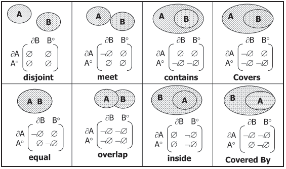

# Revisão bibliográfica

Nesta seção os principais conceitos necessários para a realização de análises de dados espaciais serão feitos. Todo o conteúdo abaixo foi criado buscando ser o mais simples, direto e didático possível.

## Representações de dados espaciais

### Vetoriais

### Matriciais

## Sistema de referência espacial

Bem, como vimos até aqui, dados espaciais possuem duas características fundamentais, o registro de diferentes fenômenos e sua localização. Mas como esta localização é vinculada a uma posição da superfície terrestre?

Para conseguirmos responder a esta pergunta devemos ir por partes. Vamos começar imaginando uma superfície plana, como a apresentada abaixo.

<center>

</center>

Agora perceba que, para gerar tal superfície o que precisou ser feito foi delimitar quatro pontos e então ligar cada um deles, veja.

<center>

</center>

Até aqui apenas criamos uma superfície e delimitamos seu espaço através dos pontos *ABCD*, vamos agora inserir valores para os lados desta superfície.

> Lembre-se que, está superfície representa um quadrado, e assim, todos os seus lados têm o mesmo tamanho.

<center>

</center>

Certo! Com os limites definidos podemos agora adicionar um ponto nesta superfície, isto porque, se cada um dos lados vai de 0 a 10, conseguimos facilmente inserir um ponto utilizando os lados como referência.

<center>

</center>

Ok, mas, o que é isso tem a ver com sistemas de referência espacial e nossa pergunta inicial? Tudo! Isto já que, para sabermos onde estava o ponto e sua localização precisamos definir os limites da superfície, e a mesma situação é necessária para os dados espaciais e a superfície terrestre.

Então, com a mesma lógica aplicada a superfície quadrada do exemplo anterior podemos mapear todo o planeta Terra, porém alguns problemas surgem para este caso. Primeiro, para começarmos a mapear a superfície terrestre devemos entender:

* Como é a superfície terrestre; e
* formas de representação.

Começando com a superfície terrestre, as ciências geodésicas, que se empenham em realizar os estudos das formas e dimensões da Terra dividem sua superfície em três formas diferentes [@rafaelmontanari2014].

<center>

</center>

Na Figura acima o geóide representa tudo que está no nível do mar, o elipsoide representa a camada abaixo do geóide e o terreno a parte superior ao geóide, além disto, tanto a representação da superfície terrestre quanto o geóide carregam diversas dificuldades quando precisam ser representados, por conta de suas características irregulares, por isto, adota-se como representação da superfície, o elipsoide.

> Com isto, pode-se concluir que, o geóide é a superfície de medição da Terra, enquanto o elipsoide é a superfície de representação.

Certo, com a definição da forma de representação da superfície terrestre já podemos realizar todo o mapeamento, correto? Ainda não, pois além de entendermos como é a superfície precisamos definir como toda esta superfície terrestre será representada. Tal representação pode ser feita de diversas formas, a variar de acordo com a necessidade, algumas dessas formas são apresentadas na Figura abaixo.


Onde, a superfície esférica normalmente é utilizada como representação da Terra quando há grandes quantidades de área a serem representadas, como por exemplo, diversos continentes ou mesmo o planeta todo [@rafaelmontanari2014] . Já para os casos, onde é necessário a representação de uma quantidade de Terra considerável, porém, não tão grande como o planeta todo, utiliza-se a representação elipsóidica [@rafaelmontanari2014], esta que inclusive é a mais utilizada nas aplicações espaciais atuais. Por fim, tem-se o modelo geoidal, que como já citado, é o que mais se aproxima da superfície terrestre, porém sua representação pode ser muito complexa para o mapeamento da superfície terrestre e a geração das localizações.

Beleza! Agora entendemos todo o fluxo necessário para realizar do mapeamento, partindo da definição da superfície e indo até suas formas de representação. Com isto, conseguimos fazer uma definição de sistemas de referência espacial que seja clara e concisa.

> Sistemas de referência espacial, ou DATUM, é um sistema coordenado, utilizado para representar características físicas e geométricas do planeta Terra.

Alguns exemplos de sistemas de referência espacial são:

* WGS 84;
* Sirgas 2000.

Muito interessante, porém, mesmo com este entendimento ficou uma dúvida, como é que os pontos vão ser representados, da mesma forma que havíamos feito no exemplo? Bem, esta pergunta é respondida nas seções seguintes.

## Projeções cartográficas

Até esta seção, todas as informações passadas de representações da superfície terrestre utilizaram modelos tridimensionais para tal feito, porém, se estas representações possuem três dimensões, como mapas bidimensionais, com o apresentado abaixo são gerados?

<br>

<center>

</center>

<br>

A resposta é simples! `Projeções cartográficas`, estas que através de transformações geométricas realizam a conversão das representações tridimensionais para bidimensionais, mantendo a correspondência entre ambas @ibge2016.

### Tipos de projeção

Por se tratar de operações geométricas é esperado que nessas existam distorções [@ibge2016], por conta disto existem diferentes tipos de superfícies geométricas de projeção que são utilizadas [@ibge2016cartog], para que as superfícies no momento da projeção foram a menor quantidade possível de distorções nas áreas de interesse.

As subseções a seguir apresentam alguns tipos de superfícies geométricas utilizadas para as projeções.

#### Projeção cilíndrica

Na projeção cilíndrica o esferoide de representação da Terra é envolvido sobre um cilindro tangente.

<br>
<center>

</center>
<br>

Neste tipo de projeção há muitas distorções dos polos, sul e norte, o que faz com que estes pareçam ter tamanhos bem maiores do que deveriam.

#### Projeção Cônica

As projeções cônicas são geradas através da utilização de um cone, que favorece a redução de distorções nos meridianos e aumenta a distorção nos polos.

<br>
<center>

</center>
<br>

#### Projeção plana

Projeção que é gerada com base em um plano, que toca em um ponto específico da representação da esfera terrestre. 

<br>
<center>

</center>
<br>

Como é possível perceber na Figura acima, neste tipo de projeção é esperado que haja muitas distorções no entorno do ponto utilizado como referência para sua criação.

## Sistema de Coordenadas 

Bem, mesmo com as várias formas de representação e projeção, é mais que necessário utilizamos de alguma técnica que nos permita, dentro de cada uma das representações, apontar sem nenhum tipo de ambiguidade as posições nas quais diferentes objetos estão na superfície terrestre.

### Sistemas de Coordenadas Geográficas

Então, para que cada objeto na superfície da Terra fosse facilmente identificado, sem nenhum tipo de ambiguidade, um sistema de linhas imaginárias, nomeado de Sistemas de Coordenadas Geográficas foi criado. Neste sistema existem dois tipos de linhas, os meridianos e os paralelos. Para os meridianos tem-se que são linhas imaginárias que cortam a Terra no sentido norte-sul e para os paralelos, tem-se linhas que circulam a Terra no sentido leste-oeste [@ibge2016cartog]. 

Vale acrescentar também que, os paralelos nos representam as latitudes, que são a distância em graus da linha do Equador até um determinado paralelo. Os valores da latitude podem variar de 0° (Sob a linha do Equador) a 90° (Sob as extremidades), sendo que, para os hemisférios norte são considerados valores positivos e para o hemisfério sul valores negativos. Já as longitudes representam a distância, em graus, entre o meridiano de Greenwich até um outro meridiano qualquer. Seus valores variam de 0° (Sob o meridiano de Greenwich) a 180° (Nas extremidades leste e oeste a Greenwich), onde, para o leste consideram-se valores positivos e ao oeste valores negativos [@ibge2016cartog].

A representação de todo este sistema imaginário de linhas pode ser visto na Figura abaixo.

<br>
<center>

</center>
<br>

### Coordenadas planas

Outra forma de realizar o mapeamento das posições das representações das superfícies terrestres é feita com o método nomeado de Coordenadas planas, que de acordo com @alexandrerosadossantos2016 são recomendados para atividades de medições de áreas e distâncias.

O sistema de coordenadas planas é baseado no sistema cartesiano de representação, onde em um plano bidimensional o cruzamento de duas linhas faz a representação da localização de um ponto [@alexandrerosadossantos2016], sendo que o eixo X representa a Latitude e o eixo Y a longitude.

Espere um pouco, representação em um plano? Até aqui vimos a representação geográfica que é feita sobre a representação esferoidal da superfície terrestre e só vimos a superfície plana nas projeções. Pois bem, para a utilização do sistema de coordenadas planas é assumido que alguma projeção seja aplicada, normalmente utiliza-se a superfície cônica na projeção dos dados para a utilização deste sistema [@alexandrerosadossantos2016].

Lembra do mercator que citamos anteriormente, a forma de representação para coordenadas planas comumente utilizada também é dele, e possui o nome de `Sistema Universal Transversa de Mercator`.


### Códigos EPSG

Os códigos **E**uropean **P**etrolem **S**urvey **G**roup (EPSG) representam uma forma de organização dos mais diversos sistemas de referências e seus sistemas de coordenadas, desta forma os códigos EPSG criam uma forma rápida e simples para a busca e identificação de qual sistema de referência e sistema de coordenadas está sendo utilizado.

Como estes códigos abrangem todos os sistemas de coordenadas do mundo, com os mais variados sistemas de coordenadas, abaixo é apresentado uma tabela com somente alguns dos códigos EPSG mais utilizados no Brasil.


| CÓDIGO EPSG | PROJEÇÃO/DATUM |
|:-----------:|:--------------:|
|     4225    |       GCS      |
|     4618    | Corrego Alegre |
|     4674    |    GCS SAD69   |
|     4326    |   GCS SIRGAS   |
|    22521    |      2000      |
|    22522    |    GCS WGS84   |
|    22523    |     Corrego    |

## Open Geospatial Consortium (OGC)

## Tipos e operações espaciais

## Relacionamentos espaciais nomeados

Realizar a caracterização do relacionamento entre os objetos espaciais permite a criação de contextos semânticos sobre estes [@Camara2005] e assim seja possível a extração de informações relevantes [@Ferreira2010].

É tido que, existem alguns tipos de relacionamentos entre os objetos que podem ser utilizados para tal caracterização, sendo eles, topológicos, métricos e de ordem [@Camara2005]. Os relacionamentos métricos representam relações que tratam especificamente de área de distância entre objetos. Já os de ordem representam a forma com que um objeto está disposto ao outro. Os topográficos consideram os relacionamentos de interseção entre os objetos.

Todos os tipos citados anteriormente serão tratados em algum momento durante esta documentação, porém nesta seção as relações topográficas terão uma enfase especial, isto já que, diferente das demais, apresenta uma estrutura própria para seus relacionamentos e ainda, segundo @Bogorny2001, representa a forma de relação espacial mais utilizada, já que esta faz analogias diretas a como percebemos a espacialidade do mundo real.

<!-- 
http://sertie.fct.unesp.br/wp-content/uploads/2017/10/17-Relacionamentos-topol%C3%B3gicos.pdf
-->
Desta forma, as subseções abaixo apresentam um pouco mais sobre os relacionamentos topográficos, também denominados de relacionamentos espaciais nomeados, uma vez que, possuem uma definição formal, que vai desde sua nomenclatura até as formas de representação.

### Relacionamentos espaciais

Esta subseção busca de forma simples, apresentar a definição formal dos relacionamentos espaciais nomeados. Em um segundo momento, na documentação do Python, R e PostGIS deste material há exemplos de aplicações de tais relacionamentos.

Para o entendimento destes relacionamentos, vamos começar fazendo a definição das regiões das geometrias, assunto base para o entendimento das formas de relação, para isto, veja a Figura abaixo.

<center>

</center>

Perceba que, para cada uma das principais geometrias há um conjunto de três definições. O interior refere-se diretamente a área interna da geometria, enquanto que a fronteira representa somente o contorno da área e o exterior sendo toda área que não é preenchida pela geometria.

Certo, vejamos agora, alguns tipos de relacionamentos espaciais:

- contains - Verifica se a geométria B contêm A;
- equal - Verifica se duas geométrias são iguais.

Porém, somente ao ler a descrição de cada um dos métodos de relacionamentos apresentados acima é possível perceber um problema. O que significa dizer que a geometria B contém A ? Ou mesmo, o que torna as geometrias iguais ?

Por conta destas questões que cada um destes métodos possui uma definição formal, que como citado anteriormente, evita qualquer tipo de múltiplas interpretações, mas como esta definição pode ser feita ? Para este problema @Bogorny2001 indica que diversas abordagens podem ser aplicadas, porém é comum a aplicação de matrizes de interseção, descrevendo o comportamento de cada região da geometria nos métodos de relacionamento.

@Camara2005 define que para casos simples pode ser utilizada a chamada Matriz de 4-Interseções, que define 8 relações espaciais nomeadas e descreve o que cada uma dessas operações leva em consideração. A Matriz de operações é apresentada abaixo.

```{r figm4, echo=FALSE ,fig.align="center", out.width = "50%",fig.cap='Matriz 4-Interseções Fronteira (∂); interior (°); exterior (-); vazio (∅); não vazio (¬∅)  - Fonte: @egenhofermdifelicepclementinie1994'}
  
```

O ponto importante da Figura apresentada acima é que, para cada um dos métodos que estão sendo apresentados, há exatamente o que ele considera, por exemplo, vejamos o método **contains**, que indica se uma geometria está ou não contida em outra. Neste método existem quatro cenários possíveis. No primeiro, é considerado se as fronteiras (∂) estão se cruzando, e caso estejam não é considerado que uma contém a outra. O segundo caso verifica se o interior (°) de uma geometria está em outro, e caso esteja é considerado que uma está contida em outra. 

Veja que interessante! Através de uma definição simples e direta já foi possível perceber os possíveis casos de cada método.

Há casos em que a Matriz de 4-Interseções não é o suficiente para fazer as representações [@Camara2005], para estes casos outros modelos podem ser utilizados, como é o caso da Matriz de 9-Interseções Dimensionalmente estendidas, apresentada na seção seguinte a esta.

### Restrições espaciais

Em certos casos, o fenômeno que está sendo representado pelos dados espaciais faz com que sejam necessários a aplicação de regras e restrições específicas sobre os mesmos [@Bogorny2001]. Esta regra também é aplicável no contexto dos relacionamentos espaciais.

Por exemplo, o método **disjoint** pode ser aplicado considerando qualquer par de geometrias, enquanto que o método **overleap** só pode ser aplicado a pares do mesmo tipo, como por exemplo geometrias de linhas com outras linhas [@Camara2005].

Caso você fique interessado e deseja uma descrição completa de todas estas restrições, não deixe de consultar o material de `Banco de dados geográficos`, disponibilizado pelo INPE.

## Matriz de 9-intersecções Estendida dimensionalmente
