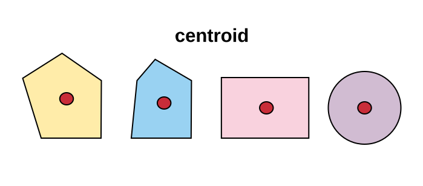
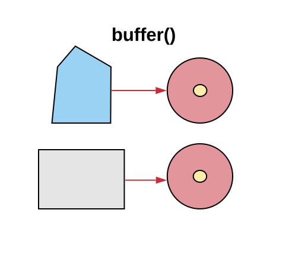

# Python `r emo::ji("sparkles")`

```{r, echo=FALSE}
# Estes comandos não devem ser executados em seu terminal
library(reticulate) 
use_python("venv/bin/python3")
```

```{python, echo = FALSE}
# Carrega por padrão, mesmo repetindo no código =D
import pandas as pd
import geopandas as gpd
import matplotlib.pyplot as plt
```

Python é uma linguagem de programação versátil, multiparadigma, que permite aos desenvolvedores criar rápidas soluções para seus problemas sem grandes preocupações com a sintaxe e formas de uso da linguagem. 

Tais características fazem Python alcançar os mais variados nichos de aplicação. Por ser uma linguagem geral para atingir tais nichos, foram criadas pela comunidade de Python diversas bibliotecas, todas seguindo a ideia da simplicidade de aplicação e prototipação da linguagem. É neste contexto que surge o GeoPandas, que fornece extensões de uso espacial para uma biblioteca de análise de dados muito conhecida na comunidade Python, o Pandas.

Desta forma, este capítulo busca explicar as principais formas de utilização do GeoPandas. Por ser baseada no Pandas, há uma pequena seção que trata sobre o uso básico da linguagem, mas é recomendado que o leitor também conheça tal biblioteca, para isto, existe o [curso de introdução à análise de dados](https://dataat.github.io/introducao-analise-de-dados/introducao.html), que explica os principais conceitos de utilização do Pandas, não deixe de conferir!

## Pandas `r emo::ji("panda")`

Com a necessidade de facilitar todo o processo de análise de dados, através de uma linguagem simples e amigável, a comunidade Python criou o Pandas, uma biblioteca que disponibiliza métodos de alto nível para a manipulação, processamento e análise dos mais variados tipos de dados.

Através dos métodos desta biblioteca é possível aplicar todo o ciclo de análise de dados, este indo desde a coleta até o processamento e análise. Para realizar tais atividades, o pandas disponibiliza diversas estruturas de dados, sendo as `Series` e os `DataFrames` as principais.

Cada uma dessas estruturas de dados, trata especificamente de uma forma de realizar a abstração do formato dos dados em código, isto faz com que seja necessário o entendimento das principais diferenças entre cada uma delas, para que seja possível realizar sua correta aplicação. Vamos buscar comparar cada uma dessas estruturas para entender suas diferenças.

As `Series` são estruturas de dados unidimensionais, possuindo apenas uma dimensão que pode ser manipulada, tal dimensão sendo chamada de índice. Já os `DataFrames` apresentam duas dimensões para a manipulação.

Estas características, na prática, indicam que, as `Series` apenas representar vetores, enquanto os `DataFrames` podem representar matrizes de N-Dimensões. Para esta ideia ficar clara, vejamos a Figura abaixo.

<center>
<div style="width:500px; height:400px">

</div>
</center>

Perceba que, as `Series` possuem o campo para o armazenamento dos dados (Representado em Azul), e o índice (Representado em roxo), não podendendo ser adicionado nenhum outro campo, isto faz com que, todos os dados tenham de ser armazenados em apenas uma coluna, em várias linhas.

Para o `DataFrame` o cenário apresentado na Figura é diferente, além dos índices, há também as colunas (Representada em vermelho), o que permite que dentro desta estrutura existam não só um conjunto de linhas, como as `Series` mas sim um conjunto de colunas, onde cada uma dessas possuem várias linhas. Na prática o que fica subentendido é que, os `DataFrames` são um conjunto de `Series`.

<center>

</center>

Isto ocorre já que, cada uma das colunas criadas dentro do `DataFrame` são `Series`, o que acaba gerando um efeito muito interessante na API do Pandas, boa parte dos métodos disponíveis para as `Series` também estão presentes nos `DataFrames`. Vamos ver alguns exemplos em código para fixar a diferença entre essas duas estruturas de dados.

### Manipulação de dados

Vamos começar criando uma `Series`.

```{python}
import pandas as pd

sr = pd.Series([1, 2, 3, 4, 5])
```

Pronto! Acabamos de criar uma `Series` com uma lista de valores, vejamos como ela está sendo representada.

```{python}
print(sr)
```

A representação está da mesma forma que vimos antes. Vamos agora fazer uma pequena manipulação dos dados, para isso, utilizaremos os métodos `loc` e `iloc` disponíveis dentro do objeto `Series` gerado, onde o método `loc` busca o índice com o nome inserido e o `iloc` busca o índice com a posição inserida. A assinatura de cada um dos métodos está descrita abaixo. Lembre-se que este método está presente tanto na classe `Series` como na classe `DataFrame`.

| DataFrame        | Series     |     
| ------------- |:-------------:|
| .loc[linha, coluna]  | .loc[linha] |
| .iloc[linha] | .iloc[linha] |


Antes de fazermos o teste destes métodos, vamos alterar o índice da nossa `Series`.

```{python}
# Vamos visualizar o índice
print(sr.index)
```

O atributo `index` devolve os elementos que estão no índice, para fazer sua mudança, basta realizar uma atribuição, veja.


```{python}
sr.index = ["um", "dois", "tres", "quatro", "cinco"]

print(sr.index)
```

Fizemos esta mudança, para que cada um dos métodos `loc` e `iloc` seja mais simples de entender. Certo, vamos começar buscando a linha que tenha o nome `dois`.

```{python}
print(sr.loc["dois"])
```

Agora vamos buscar a linha que está na posição dois.

```{python}
print(sr.iloc[1]) # Lembre-se, o Python começa a contar no zero =D
```

Percebeu? Temos o mesmo resultado, muito interessante não ? Além disso ainda posso aplicar filtros sob os dados,utilizando o conceito de `indexação booleana`, onde através de um vetor de `VERDADEIRO` e `FALSO` é possível selecionar as linhas.

Vamos buscar somente os valores que são acima de três.

```{python}
print(sr[sr > 3])
```

> Dica: O que ocorre nesta parte é, dentro das chaves de `sr` (sr[]) é passado a expressão `sr > 3` que devolve uma lista de verdadeiros e falsos, fazendo assim o filtro.

Muito interessante! Mas até aqui trabalhamos com apenas uma dimensão, vamos tentar acrescentar mais, para isto, primeiro vamos criar uma matriz.

```{python}
matriz = [
  [1, 2, 3], [4, 5, 6]
]
```

A matriz criada é representada por uma lista de listas. Vamos tentar criar uma `Series` com esta matriz.

```{python}
sr = pd.Series(matriz)

print(sr)
```

Eita! Perceba que, em cada linha há uma lista de valores, o que é ruim! Já que a manipulação fica difícil (Tenta fazer uma indexação booleana, vai falhar `r emo::ji("cry")`).

Para este caso, existem os `DataFrames`! Vamos começar criando um com a mesma matriz gerada anteriormente.

```{python}
df = pd.DataFrame(matriz)

print(df)
```

Opa! Agora o cenário é outro, conseguimos colocar cada um dos valores em seu devido lugar. Perceba que a representação mudou bastante, aqui temos várias colunas de dados, e mesmo assim, todos os métodos já apresentados até aqui funcionam. Vai lá, tenta!

Uma coisa importante sobre os `DataFrames` são suas colunas, para acessar elas podemos fazer da seguinte forma.

```{python}
print(df[0])
```

Viu! Estamos acessando a primeira coluna, se fizermos a mesma coisa, com a segunda também vai funcionar (Tenta inserir o número 1, para você ver o que acontece).

> Dica: Ao fazer df[0], estamos buscando o "nome" da coluna, e não sua posição

Da mesma forma que eu podemos recuperar o índice com o atributo `index` podemos recuperar as colunas com o atributo `columns`

```{python}
print(df.columns)
```

Para fazer a mudança dos nomes de cada coluna a mesma regra do `index` é válida.

```{python}
df.columns = ["col1", "col2", "col3"]

print(df.columns)
```

Vamos recuperar a primeira coluna novamente

```{python}
print(df["col1"])
```

Assim, fica mais fácil entender que, quando se trata de colunas, estamos buscando os nomes, e não simplesmente as posições.

Bom, agora que já entendemos toda a utilização básica do Pandas, vamos começar a falar um pouco sobre o GeoPandas `r emo::ji("purple_heart")`

## GeoPandas `r emo::ji("earth")``r emo::ji("panda")`

Com o entendimento do que é a biblioteca Pandas, suas estruturas de dados e principais características, o estudo do GeoPandas pode ser iniciado. Mas o que é o GeoPandas ?

> GeoPandas é um projeto open-source que busca facilitar o trabalho com dados vetoriais em Python, para isto, tem como base as estruturas de dados do Pandas

Desta forma, a ideia básica por trás do GeoPandas é adicionar o suporte a manipulação de dados espaciais as estruturas de dados do Pandas, e com isto prover formas de manipulação simples e direta a tais dados.

Para fazer isto, o GeoPandas utiliza estruturas de dados geométricas implementadas pela biblioteca [Shapely](https://shapely.readthedocs.io/en/stable/manual.html) dentro das `Series` e dos `DataFrames`. Com esta adição, duas estruturas de dados surgem, as `GeoSeries` e os `GeoDataFrames`. 

Este conceito pode ser melhor entendido com a observação da Figura abaixo.

<center>

</center>

Perceba que, há a mesma estrutura que foi apresentada na seção anterior, com as geometrias sendo o diferencial nas estruturas de dados.

Na prática o que ocorre é, todas as formas de manipulação geométricas, que como citadas são implementadas com o Shapely, são implementadas em uma classe `GeoPandasBase` que é extendida pelas `GeoSeries` e `GeoDataFrames`, da mesma forma, essas também extendem as estruturas de dados equivalentes do Pandas, veja a Figura abaixo.

<center>

</center>

Como a `GeoSeries` e os `GeoDataFrames` são especializações diretas das `Series` e dos `DataFrames` as mesmas características são mantidas, onde, respectivamente, um armazena apenas uma coluna de valores, tendo uma dimensão de manipulação e o outro armazena diversas colunas com duas dimensões de manipulação, da mesma forma como apresentado na seção anterior.

Para fixar o funcionamento de cada uma dessas estruturas, vamos fazer alguns testes com a API do GeoPandas. 

### GeoSeries e GeoDataFrames

Para começar os testes, vamos importar a biblioteca de geometrias, `Shapely` e o GeoPandas.

```{python}
import shapely
import geopandas as gpd
```

Agora, vamos criar uma `GeoSeries`.

```{python}
gsr = gpd.GeoSeries([
  shapely.geometry.Point(1, 1)
])
```

> Dica: A geometria criada não possui qualquer tipo de referência espacial, portanto representa apenas um ponto no plano cartesiano.

Veja que acabamos de criar uma `GeoSeries` que armazena uma geometria de ponto, vamos visualizar o objeto criado.

```{python}
print(gsr)
```

A forma é exatamente a mesma de uma `Series`. Vamos criar um novo objeto com mais geometrias inseridas.

```{python}
gsr = gpd.GeoSeries([
  shapely.geometry.Point(1, 1),
  shapely.geometry.Point(2, 2),
  shapely.geometry.Point(4, 3)
])

print(gsr)
```

Caso eu queira visualizar não só a tabela, mas sim a representação das geometrias criadas no espaço, é possível utilizar o método `plot`.

```
gsr.plot()
```
<center>
```{python, echo = FALSE}
gsr.plot(figsize=(6, 6))
plt.show()
```
</center>

Mas as `GeoSeries` podem ser limitadas em alguns casos, imagine que para a realização de um estudo seja necessário não só a geolocalização ou a representação geométrica no espaço, mas também características do ambiente, qualquer tipo de informação que não a espacial. Nestes casos podemos utilizar os `GeoDataFrames` que além de colunas de geometria permitem o armazenamento de outras informações, isto por permitir múltiplas colunas. Vamos criar um para fazer testes.

```{python}
gdf = gpd.GeoDataFrame({
  'atributo_a': [10, 11, 12],
  'geometria': [
    shapely.geometry.Point(1, 1),
    shapely.geometry.Point(2, 2),
    shapely.geometry.Point(4, 3)
  ]
})
```

Visualizando o resultado

```{python}
print(gdf)
```

Agora as geometrias passam a ser vinculadas com outros valores, o que pode ser muito útil em vários cenários. Até aqui foram criadas geometrias sem nenhum tipo de ligação com o mundo real, então, vamos agora trabalhar um pouco com dados que façam esta representação, para isto, vejamos como carregar dados espaciais com o GeoPandas.

### Leitura e escrita de dados

Além de todas as características citadas até aqui, o GeoPandas ainda ajuda na leitura e na escrita de dados vetoriais, tudo seguindo o padrão de facilidade de uso do Pandas.

Para realizar essas operações o GeoPandas utiliza como base a biblioteca [Fiona](https://fiona.readthedocs.io/en/latest/manual.html), que traz suporte a leitura e escrita de uma enorme variedade de formatos vetoriais, sendo alguns deles:

- GeoJSON;
- GPSTrackMaker;
- ESRI Shapefile;
- FileGDB;
- OpenFileGDB.

Além destes formatos a biblioteca aceita vários outros, para a lista completa de formatos suportados, consulte a [documentação](https://fiona.readthedocs.io/en/latest/manual.html) do Fiona.

Para fazer alguns testes utilizando as funcionalidades de leitura dos dados, vamos carregar um dado vetorial, dos estados do Brasil que estão armazenados em um `shapefile`.

```{python}
gdf = gpd.read_file("../data/1_estados_do_brasil_shape/Brasil.shp")
```

> Estes dados estão disponíveis no [repositório](https://github.com/dataAt/introducao-analise-de-dados-espaciais/tree/master/data) do curso.

Com os dados carregados, vamos visualizar qual foi a estrutura gerada ao carregar os dados.

```{python}
print(type(gdf))
```

Um `GeoDataFrame`! Isto é feito por padrão pela biblioteca, assim, independente do formato de entrada, o GeoPandas busca inserir os dados dentro de um `GeoDataFrame`. Certo, vamos olhar então o que está dentro deste objeto.

```{python}
print(gdf.head(5))
```

É possível perceber neste resultado que, ao carregar os dados, as representações espaciais presentes no arquivo, foram inseridas em uma coluna chamada `geometry` e que, além dessa coluna, existem outras que vinculam múltiplas informações a cada uma das representações espaciais presentes no arquivo.

> Lembre-se, o método `head` é herdado do Pandas, ele possibilita a visualização das linhas iniciais da tabela de dados.

A representação acima não nos mostra todas as colunas de informações que temos no conjunto de dados carregados, para saber quais são todas elas, utilizaremos o atributo `columns`.

```{python}
print(gdf.columns)
```

Olha que interessante! Para cada estado, há seu nome, a região a que pertence, sua Unidade da Federação (UF) e o código desta UF. Agora que já sabemos como estão nossos dados, vamos voltar um pouco na coluna `geometry`.

```{python}
print(gdf["geometry"].head(5))
```

Entenda, a geometria escolhida para representar cada um dos estados do Brasil foi o polígono, e isto é possível de visualizar na coluna `geometry`. Outro fato importante sobre esta coluna é que, ela não precisa ter este nome, ele é definido automaticamente pelo GeoPandas para que as coisas sejam padronizadas e fiquem mais simples, mas, caso eu queira alterar, posso fazer isto facilmente da seguinte forma.

```{python}
gdf = gdf.rename_geometry("geometria")
```

Ao fazer isto, vamos visualizar as colunas do `GeoDataFrame` alterado.

```{python}
print(gdf.columns)
```

Mas, e se nos dados que eu estiver carregando existirem mais de uma coluna de representações espaciais, como o GeoPandas entende qual deve ser utilizada? Bem, por padrão ele escolherá a primeira delas e a tratará como a coluna `geometry` do conjunto de dados, porém se eu quiser fazer a alteração, também é possível.

Primeiro, vamos aprender a identificar como o GeoPandas mostra a coluna que ele está utilizando como padrão, para isto o atributo `geometry` é utilizado.

```{python}
print(gdf.geometry.head(5))
```

Este atributo devolve os dados da coluna padrão de geometrias. Vamos ver qual é o nome da coluna de onde ele retira tais dados.

```{python}
print(gdf.geometry.name)
```

O nome é exatamente o mesmo da coluna que renomeamos! Vamos trocar esta coluna padrão, para fazer este teste, vou duplicar a coluna que contém as geometrias, porém cada uma terá um nome.

```{python}
gdf["geometria_dois"] = gdf["geometria"]

print(gdf.columns)
```

Feito isto, vamos alterar a coluna padrão de geometrias

```{python}
gdf = gdf.set_geometry("geometria_dois")
```

Ao visualizar o resultado, percebemos que a mudança foi realizada com sucesso.

```{python}
print(gdf.geometry.name)
```

> A diferença entre o método `rename_geometry` e `set_geometry` está no ponto em que, a `set_geometry` altera a coluna que está sendo considerada como padrão para geometrias, enquanto a `rename_geometry` altera o nome da coluna padrão de geometrias.

Por fim, vamos visualizar a disposição destes dados em uma figura, para isto, utilizamos o método `plot`.

```
gdf.plot()
```

```{python, echo = FALSE}
gdf.plot()
plt.show()
```

O ponto a ser entendido do método `plot` é que, ele utiliza a coluna de geometrias padrão para gerar a figura, então, caso haja alguma inconsistência neste coluna este método terá problemas. Esta lógica se aplica a todos os outros métodos do GeoPandas que utilizam a representação espacial para fazer as operações.

Vamos salvar os resultados em um arquivo `shapefile`, para isto, façamos a utilização do método `to_file`.

```{python}
del gdf["geometria"] # Removendo coluna extra de geometrias

gdf.to_file('tmp/estados_do_brasil_editado.shp')
```

Não deixe de consultar a documentação do Pandas e do GeoPandas, por conta das bibliotecas trabalharem juntas, muitos formas de dados podem ser escritos e tratados, no GeoPandas é possível até mesmo ler dados diretamente de um banco de dados espacial (PostGres com PostGIS). 

### Manipulação geométrica

O GeoPandas oferece diferentes métodos para a manipulação dos dados espaciais carregados, esta seção fará a apresentação de alguns destes métodos.

> É importante lembrar que, todos estes métodos estão orientados a coluna de geometria padrão, vista na subseção anterior.

As operações apresentadas nas subseções a seguir, são representadas por métodos e atributos das `GeoSeries` e dos `GeoDataFrames`.

#### area

Vamos começar com as operações de área, que de forma análoga ao nome, cálcula a área da geometria em questão. Vejamos a Figura abaixo que faz uma representação desta operação em diferentes formas geométricas.


O resultado da operação, devolve o cálculo da área, representado em vermelho na Figura acima. Para exemplificar, vamos utilizar o conjunto de dados dos estados do Brasil

```{python}
estados_do_brasil = gpd.read_file("../data/1_estados_do_brasil_shape/Brasil.shp")
```

> Lembre-se, este conjunto de dados está disponível no [repositório](https://github.com/dataAt/introducao-analise-de-dados-espaciais/tree/master/data) do curso

Depois de carregar os dados, vamos utilizar o atributo `area`, que realiza a operação e devolve a àrea para cada uma das linhas do conjunto de dados

```{python}
print(estados_do_brasil.area.head(5)) # Exibindo somente as 5 primeiras
```

A área é devolvida na unidade de medida da projeção espacial utilizada no conjunto de dados, estes detalhes serão apresentados nas seções seguintes.

#### bounds

O atributo `bounds` devolve as coordenadas mínimas e máximas da região coberta pela geometria. Sua representação é feita na Figura abaixo.


Perceba que, para cada figura é criado um retângulo que a envolve (Também chamado de retângulo envolvente) e as coordenadas mínimas e máximas são retiradas desses. Vejamos um exemplo

```{python}
print(estados_do_brasil.bounds.head(5))
```

#### centroid

O atributo `centroid` devolve o ponto central da geometria. Sua representação é feita na Figura abaixo.



O ponto retornado para cada geometria é apresentado em vermelho. Vejamos um exemplo com o GeoPandas.

```{python}
centroids_dos_estados = estados_do_brasil.centroid
```

Se olharmos para o resultado teremos uma `GeoSeries` com um ponto para cada um dos estados, vamos visualizar estes pontos rapidamente.

```
centroids_dos_estados.plot()
```

```{python, echo=FALSE}
centroids_dos_estados.plot()

plt.show()
```

Para fazermos um pequeno experimento, famos pegar a figura com os estados e fazer seu plot junto com os centroids.

```
base = estados_do_brasil.plot()
centroids_dos_estados.plot(ax=base, marker="o", color="red")
```

```{python, echo=FALSE}
base = estados_do_brasil.plot()
centroids_dos_estados.plot(ax=base, marker="o", color="red")
plt.show()
```

#### buffer

O método `buffer` cria um circulo entorno de um ponto, e pode ser aplicado em diferentes tipos de análises espaciais. Sua representação é feita na Figura abaixo.

<center>

</center>

Para testar esta operação, vamos utilizar os `centroids` extraídos na seção anterior.

```{python}
buffers = centroids_dos_estados.buffer(2)
```

Da mesma forma que outros métodos que trabalham com distâncias, os valores dependem diretamente das projeções espaciais utilizadas. Vamos fazer um plot do resultado gerado sob o mapa dos estados do Brasil.

```
base = estados_do_brasil.plot()
base = buffers.plot(ax = base, color = 'yellow')

# Adicionando os centroids também, para testar =D
centroids_dos_estados.plot(ax = base, color = 'red')
```

```{python, echo=FALSE}
base = estados_do_brasil.plot()
base = buffers.plot(ax = base, color = 'yellow')
# Adicionando os centroids também, para testar =D
centroids_dos_estados.plot(ax = base, color = 'red')

plt.show()
```

#### envelope

Por fim, o método `envelope` cria o mesmo retângulo envolve utilizado no atributo `bounds`, com a diferença que, neste caso a geometria é devolvida. A representação desta operação é feita na Figura abaixo.

<center>

</center>

Para testar, vamos pegar os buffers gerados anteriormente e então gerar seu retângulo envolvente.

```{python}
envelopes = buffers.envelope
```

Da mesma forma que nos demais, vamos visualizar o resultado.

```
base = estados_do_brasil.plot()

envelopes.plot(ax = base, color = 'green')
```

```{python, echo = FALSE}
base = estados_do_brasil.plot()

envelopes.plot(ax = base, color = 'green')
plt.show()
```

### Seleção e filtro de dados

O GeoPandas ainda fornece métodos para a seleção e filtros de dados baseados na posição espacial. Nesta seção veremos dois desses, que podem ser muito úteis nas mais diversas análises.

#### distance

Vamos começar com o método `distance`, que calcula a distância entre duas geometrias. Sua operação é representada na Figura abaixo.

<center>

</center>

Para testar esta operação, vamos carregar dois dados vetoriais, cada um representando um estado do Brasil.

```{python}
estado_maranhao = gpd.read_file("../data/2_estado_sp_shape/shape_estado-sp.shp")
estado_saopaulo = gpd.read_file("../data/3_estado_ma_shape/shape_estado-ma.shp")
```

Vamos visualizar os dois juntos. Nesta visualização, para ela ter sentido, abaixo dos estados foi fazer o plot do mapa do Brasil.

```
base = estados_do_brasil.plot()

base = estado_maranhao.plot(ax = base, color = 'green')
estado_saopaulo.plot(ax = base, color = 'yellow')
```

```{python, echo = FALSE}
base = estados_do_brasil.plot()

base = estado_maranhao.plot(ax = base, color = 'green')
estado_saopaulo.plot(ax = base, color = 'yellow')

plt.show()
```

Certo, vamos calcular a distância entre cada um deles.

```{python}
distancia = estado_saopaulo.distance(estado_maranhao)

print(distancia)
```

Feito, com isto tem-se a distância entre as duas geometrias, que neste caso representa os estados do Maranhão e São Paulo. Esta mesma operação pode ser utilizada como uma forma de consulta aos dados, por exemplo, buscar estados que estejam a X de distância de outro.

#### contains

O método `contains` verifica se uma geometria está contida em outra, sua representação visual é apresentada abaixo .

<center>

</center>

Vamos fazer um teste da operação com o estado do Amazonas, verificando se sua geometria está contida nas nos dados de estados do Brasil.

Primeiro, vamos retirar do `GeoDataFrame` as informações do estado do Amazonas, para isto aplicamos um filtro booleano, herdado do Pandas.


```{python}
estado_amazonas = estados_do_brasil[estados_do_brasil["ESTADOS"] == "Amazonas"] # Indexação booleana
```

Agora vamos verificar se o estado está contido em alguma geometria dos estados do Brasil.

```{python}
amazonas_esta_presente = estados_do_brasil.contains(estado_amazonas)

print(amazonas_esta_presente.head(10))
```

Veja que em uma das linhas apareceu `True`, isto indica que a geometria do estado do Amazonas está contida nesta, que se formos olhar a linha do `GeoDataFrame` com os dados do estado, indica exatamente a linha do estado do Amazonas.

```{python}
print(estados_do_brasil[amazonas_esta_presente])
```

#### intersects

Por fim, na parte de seleção através dos dados espaciais, vamos testar o método `intersects`, que verifica se uma geometria faz intersecção com outra. Vale lembrar que, é tido como uma intersecção, quando um objeto cruza de alguma maneira, seu limite e seu interior com outro objeto. A operação pode ser vista abaixo.

<center>

</center>

Para realizar este teste, vamos carregar um arquivo que contém todos rios do nosso país. E então verificar quais desses fazem intersecção com o estado do Pará.

```{python}
rios_brasil = gpd.read_file("../data/4_rios_brasil/Brasil_rios.shp")
```

Antes de continuar, vamos visualizar os dados, junto aos estados do Brasil.

```
base = estados_do_brasil.plot(color = "gray")
rios_brasil.plot(ax = base, color = 'red')
```

```{python}
base = estados_do_brasil.plot(color = "gray")
rios_brasil.plot(ax = base, color = 'red')

plt.show()
```

Agora vamos pegar somente o estado do Pará do conjunto de estados e verificar quais rios fazem intersecção com ele.

```{python}
estado_para = estados_do_brasil[estados_do_brasil["ESTADOS"] == "Pará"]
rios_intersect_para = rios_brasil.intersects(estado_para)

print(rios_intersect_para.head(5))
```

O resultado é uma lista booleana, desta forma, vamos filtrar o conjunto de dados de rios com este índice, e então verificar quais deles fazem intersecção com o estado do Pará.

```{python}
rios_para = rios_brasil[rios_intersect_para]
```

Com os dados separados, vamos fazer um plot para melhor visualizar o resultado. Neste plot vamos utilizar o `matplotlib`, para criar vários subplots.

```{python}
import matplotlib.pyplot as plt

# Criando figura e os subplots
fig, (ax1, ax2) = plt.subplots(ncols=2)

base = estados_do_brasil.plot(ax = ax1, color = 'blue')
rios_para.plot(ax = base, color = 'red')

base = estado_para.plot(ax = ax2, color = 'gray')
rios_para.plot(ax = base, color = 'red')

plt.show()
```

Veja que esta operação verificou somente aqueles que fazem intersecção com as fronteiras, não indicando que está contido ou próximo ao estado.

### Manipulação de projeções

Uma operação muito importante quando se está trabalhando dados espaciais é a manipulação de suas projeções, estas que como explicado no capítulo anterior, fazem as representações das geometrias no espaço, o GeoPandas fornece um método muito simples para tal operação, o `to_crs`, que altera a projeção dos dados sem grandes problemas.

<center>

</center>

Este foi o capítulo sobre GeoPandas e suas facilidades de uso `r emo::ji("star2")`, não deixe de consultar a documentação oficial e fazer seus testes `r emo::ji("dizzy")`.
