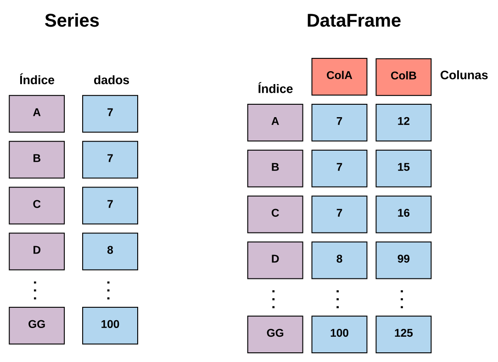
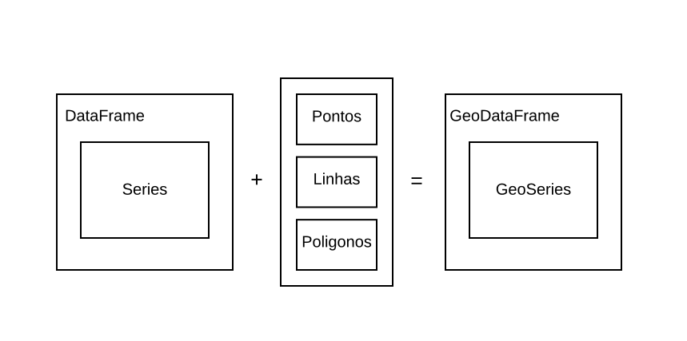
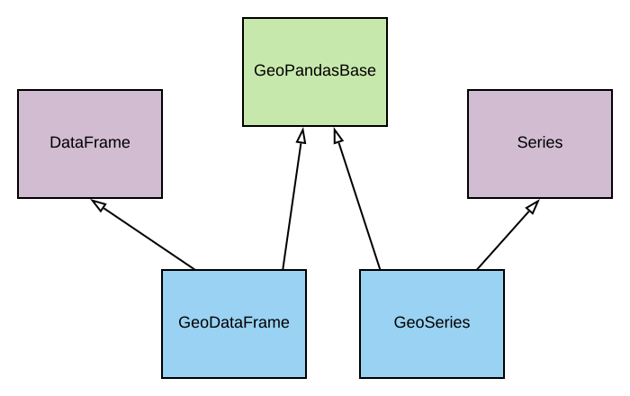

# Python `r emo::ji("sparkles")`

```{r, echo=FALSE}
# Estes comandos não devem ser executados em seu terminal
library(reticulate) 
use_python("venv/bin/python3")
```

```{python, echo = FALSE}
# Carrega por padrão, mesmo repetindo no código =D
import pandas as pd
import geopandas as gpd
```

Python é uma linguagem de programação versátil, multiparadigma, que permite aos desenvolvedores criar rápidas soluções para seus problemas sem grandes preocupações com a sintaxe e formas de uso da linguagem. 

Por ser uma linguagem de aplicações gerais, 


Essas características trouxeram para Python uma comunidade extremamente ativa e acolhedora, o que gerou uma infinidade de bibliotecas para a 

Um ponto forte da linguagem é a maturidade de seu ecossitema, que através de milhares de pacotes disponiblizados por uma comunidade incrível, faz com que a linguagem possa ser fácilmente aplicada nos mais variados contextos.

Nesta seção do material de introdução à análise de dados espaciais vamos discutir uma das várias soluções existentes para a manipulação de dados espaciais, o `GeoPandas`.

Para começarmos, vamos falar um pouco sobre o `Pandas` a biblioteca utilizada como base para a criação do `GeoPandas`.

Como citado anteriormente, Python é uma linguagem de programação que não foi criada com nenhum propósito específico, assim como acontece com linguagens como R e Julia, que desde sua criação tiveram o foco em uma área específica.

Desta forma, não podemos esperar que por padrão a linguagem disponibilize funcionalidades para a leitura e escrita de dados, nos mais variados formatos, ou mesmo diferentes métodos para análise de tais dados. É neste contexto que o pandas é inserido.

<!-- Citar aqui em cima que, as bibliotecas foram criadas por conta da característica geral da linguagem, e que sua facilidade atraiu utilizados das mais variadas áreas -->

<!-- Nesta seção, primeiro será feito a introdução ao pandas, biblioteca base utilizada pelo GeoPandas para a realização de toda a manipulação dos dados  -->

<!-- ToDo: Inserir isto aqui na intro para ajudar que está começando -->
<!-- Para mais informações para a utilização do Pandas, consulte o [material do curso de introdução à análise de dados](https://dataat.github.io/introducao-analise-de-dados/introducao-ao-python.html) -->

## Pandas

Com a necessidade de facilitar todo o processo de análise de dados, através de uma linguagem simples e amigável, a comunidade Python criou o Pandas, uma biblioteca que disponibiliza métodos de alto nível para a manipulação, processamento e análise dos mais variados tipos de dados.

Através dos métodos desta biblioteca é possível aplicar todo o ciclo de análise de dados, este indo desde a coleta até o processamento e análise. Para realizar tais atividades, o pandas disponibiliza diversas estruturas de dados, sendo as `Series` e os `DataFrames` as principais.

Cada uma dessas estruturas de dados, trata especificamente de uma forma de realizar a abstração do formato dos dados em código, isto faz com que seja necessário o entendimento das principais diferentes entre cada uma delas, para que seja possível realizar sua correta aplicação. Vamos buscar comparar cada uma dessas estruturas para entender suas diferenças.

As `Series` são estruturas de dados unidimensionais, possuindo apenas uma dimensão que pode ser manipulada, tal dimensão sendo chamada de índice. Já os `DataFrames` apresentam duas dimensões para a manipulação.

Estas características, na prática, indicam que, as `Series` apenas representar vetores, enquanto os `DataFrames` podem representar matrizes de N-Dimensões. Para esta ideia ficar clara, vejamos a Figura abaixo.

<center>
<div style="width:500px; height:400px">

</div>
</center>

Perceba que, as `Series` possuem o campo para o armazenamento dos dados (Representado em Azul), e o índice (Represetnado em roxo), não podendendo ser adicionado nenhum outro campo, isto faz com que, todos os dados tenham de ser armazenados em apenas uma coluna, em várias linhas.

Para o `DataFrame` o cenário apresentado na Figura é diferente, além dos índices, há também as colunas (Representada em vermelho), o que permite que dentro desta estrutura existam não só um conjunto de linhas, como as `Series` mas sim um conjunto de colunas, onde cada uma dessas possuem várias linhas. Na prática o que fica subentendido é que, os `DataFrames` são um conjunto de `Series`.

<center>

</center>

Isto ocorre já que, cada uma das colunas criadas dentro do `DataFrame` são `Series`, o que acaba gerando um efeito muito interessante na API do Pandas, boa parte dos métodos disponíveis para as `Series` também estão presentes nos `DataFrames`. Vamos ver alguns exemplos em código para fixar a diferença entre essas duas estruturas de dados.

### Manipulação de dados

Vamos começar criando uma `Series`.

```{python}
import pandas as pd

sr = pd.Series([1, 2, 3, 4, 5])
```

Pronto! Acabamos de criar uma `Series` com uma lista de valores, vejamos como ela está sendo representada.

```{python}
print(sr)
```

A representação está da mesma forma que vimos antes. Vamos agora fazer uma pequena manipulação dos dados, para isto, utilizaremos os métodos `loc` e `iloc` disponíveis dentro do objeto `Series` gerado, onde o método `loc` busca o índice com o nome inserido e o `iloc` busca o índice com a posição inserida. A assinatura de cada um dos métodos está descrita abaixo. Lembre-se que este método está presente tanto na classe `Series` como na classe `DataFrame`.

| DataFrame        | Series     |     
| ------------- |:-------------:|
| .loc[linha, coluna]  | .loc[linha] |
| .iloc[linha] | .iloc[linha] |


Antes de fazermos o teste destes métodos, vamos alterar o índice da nossa `Series`.

```{python}
# Vamos visualizar o índice
print(sr.index)
```

O atributo `index` devolve os elementos que estão no índice, para fazer sua mudança, basta realizar uma atribuição, veja.


```{python}
sr.index = ["um", "dois", "tres", "quatro", "cinco"]

print(sr.index)
```

Fizemos esta mudança, para que cada um dos métodos `loc` e `iloc` seja mais simples de entender. Certo, vamos começar buscando a linha que tenha o nome `dois`.

```{python}
print(sr.loc["dois"])
```

Agora vamos buscar a linha que está na posição dois.

```{python}
print(sr.iloc[1]) # Lembre-se, o Python começa a contar no zero =D
```

Percebeu? Temos o mesmo resultado, muito interessante não ? Além disso ainda posso aplicar filtros sob os dados,utilizando o conceito de `indexação booleana`, onde através de um vetor de `VERDADEIRO` e `FALSO` é possível selecionar as linhas.

Vamos buscar somente os valores que são acima de cinco.

```{python}
print(sr[sr > 5])
```

> Dica: O que ocorre nesta parte é, dentro das chaves de `sr` (sr[]) é passado a expressão `sr > 5` que devolve uma lista de verdadeiros e falsos, fazendo assim o filtro.

Muito interessante! Mas até aqui trabalhamos com apenas uma dimesão, vamos tentar acrescentar mais uma dimesão a estes dados.

```{python}
matriz = [
  [1, 2, 3], [4, 5, 6]
]
```

Criei uma matriz, esta que é representada por uma lista de listas. Vamos tentar criar uma `Series` com esta matriz.

```{python}
sr = pd.Series(matriz)

print(sr)
```

Eita! Perceba que, em cada linha há uma lista de valores, o que é ruim! Já que a manipulação fica difícil (Tenta fazer uma indexação booleana, vai falhar `r emo::ji("cry")`).

Para este caso, existem os `DataFrames`! Vamos começar criando um com a mesma matriz gerada anteriormente.

```{python}
df = pd.DataFrame(matriz)

print(df)
```

Opa! Agora o cenário é outro, conseguimos colocar cada um dos valores em seu devido lugar. Perceba que a representação mudou bastante, aqui temos várias colunas de dados, e mesmo assim, todos os métodos já apresentados até aqui funcionam. Vai lá, tenta!

Uma coisa importante sobre os `DataFrames` são suas colunas, para acessar elas podemos fazer da seguinte forma.

```{python}
print(df[0])
```

Viu! Estamos acessando a primeira coluna, se fizermos a mesma coisa, com a segunda também vai funcionar (Tenta inserir o número 1, para você ver o que acontece).

> Dica: Aqui estamos buscando o "nome" da coluna, e não sua posição

Da mesma forma que eu podemos recuperar o índice com o atributo `index` podemos recuperar as colunas com o atributo `columns`

```{python}
print(df.columns)
```

Para fazer a mudança dos nomes de cada coluna a mesma regra do `index` é válida.

```{python}
df.columns = ["col1", "col2", "col3"]

print(df.columns)
```

Vamos recuperar a primeira coluna novamente

```{python}
print(df["col1"])
```

Assim, fica mais fácil entender que, quando se trata de colunas, estamos buscando os nomes, e não simplesmente as posições.

Bom, agora que já entendemos toda a utilização básica do Pandas, vamos começar a falar um pouco sobre o GeoPandas `r emo::ji("purple_heart")`

## GeoPandas

Com o entendimento do que é a biblioteca Pandas, suas estruturas de dados e principais características, o estudo do GeoPandas pode ser iniciado. Da mesma forma que foi feito com o Pandas, vejamos a definição do site oficial do projeto.

> GeoPandas é um projeto open-source que busca facilitar o trabalho com dados geoespaciais em Python, para isto, tem como base as estruturas de dados do Pandas

Desta forma a ideia básica por trás do GeoPandas é adicionar o suporte a manipulação de dados espaciais no Pandas, e com isto prover manipulação simples e direta aos dados espaciais.

<!--O início da explicação da biblioteca aqui deve ser igual o Pandas no minicurso anterior
  GeoPandas é uma biblioteca ... criada sob o pandas para prover a facilidade de manipulação de dados
  do pandas em dados espaciais...
  
  A biblioteca é criada sob duas estruturas de dados principais: GeoSeries e GeoDataFrames que são
  especializações diretas das classes Series e DataFrame. O diagrama de classe abaixo apresenta esta   relação. (Colocar as especializações e também a especialização da classe GeoPandasBase)
  
  Com estas classes é possível fazer a representação de geodados facilmente, além de sua manipulação 
  (Esta parte ficou repetida mas é só o exemplo base).
  
  As funcionalidades apresentadas pelo GeoPandas serão apresentadas nas subseções abaixo.
-->

<!-- Antes de falar das classes que são herdades pelo tipo, inserir a seguinte figura -->
<!-- A mesma facilita a explicação da relação entre o pandas e o geopandas -->
<center>

</center>


<center>

</center>

### GeoSeries


### GeoDataFrames


### Leitura e escrita de dados

<!--
  Aqui deixar claro que, a ideia do pandas é trabalhar com dados vetoriais, ou, em caso de dados
  matriciais, que sua representação seja simplificada em tabelas, o que pode trazer certo desempenho... (Deixar claro para o pessoal não achar que a leitura de imagens por exemplo possa ser feito nessa lib.)
-->

<!-- Explicar aqui que além da manipulação o GeoPandas ajuda na leitura e escrita
da mesma forma como é feito pelo pandas (Inclusive com a mesma facilidade).

  O geopandas pode fazer a leitura dos seguintes formados de dados: A, B, C.
  
  Para entendermos melhor como funciona cada um destes dados, veja:
  
   - Exemplo de consumo de dados Shapefile A
   - Exemplo de consumo de dados Shapefile B;
   - Exemplo de consumo de dados Shapefile C;
-->

### Manipulação geométrica

<!--
  Aqui cite tudo o que o pandas pode fazer, porém mostre exemplos apenas do Buffer e do envelope.
  Pq o resto acaba sendo bem específico e pode não ter tanta aplicação para os alunos do curso em um
  primeiro momento.
-->

### Manipulação de projeções

<!--
  Falar brevemente como o GeoPandas faz estas manipulações.
-->


### Seleção e filtro de dados

<!--
  Na seção do Pandas explique os filtro convencionais de busca de dados, pq nesta parte conseguimos fazer um gancho e dizer: "Veja, além de toda a forma de busca do pandas, o geopandas ainda consegue fazer indexação levando em consideração a localização no espaço dos dados que estão salvos".
-->

### Visualização dos resultados

<!--
  Para fazer a visualização dos resultados, mostra que o próprio geopandas permite os plots, aqui utilize os dados já carregado nos exemplos anteriores.
  
- Citar que, para facilitar a visualização a biblioteca GeoPlot pode ser empregada.
-->
