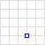
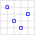
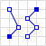
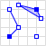

# Introdução ao postgis `r emo::ji("elephant")`
Uma das principais características que diferenciam os bancos de dados 
geográficos dos demais bancos de dados convencionais, é a presença de uma coluna 
com a finalidade de armazenar uma propriedade geográfica do registro. Além disso
, os bancos de dados geográficos também devem oferecer de forma otimizada 
suporte à operações espaciais. Diferente de um passado não muito distante, 
atualmente existem muitas alternativas de bancos de dados geográficos, como: 
[SQL Server Spatial][1], [ESRI ArcSDE][2], [Oracle Spatial][3], [GeoMesa][4], 
[PostGIS][5], etc. Cada uma destas opções tem o objetivo em comum trabalhar com 
dados geográficos e todas estão sendo muito utlizadas em diversos segmentos nos
dias de hoje, sendo o PostGIS a mais popular de todas.

O PostGIS é uma extensão geográfica *open source* para o SGDB (Sistema 
Gerenciador de Banco de Dados) [PostgreSQL][6], lançada em 2001 inicialmente por 
uma empresa canadense chamada Refractions Research. O PostGIS segue a 
padronização estabelecida pelo OGC (*Open GIS Consortium*), que provê suporte 
para todos os objetos e funções da especificação [SFS][7] (*Simple Features for* 
*SQL*). De forma concisa, a especificação SFS foi criada pelo OGC (consórcio 
formado por empresas, universidades, etc) e trata das questões de representação
da componente espacial e vetorial dos dados geográficos, garantindo assim, a 
interoperabilidade entre os sistemas os utilizam. 

Este capítulo tem como objetivo introduzir ao leitor à extensão espacial PostGIS
. Ao final, o leitor deverá está apto a configurar corretamente o ambiente para 
a utilização da ferramente, carregar arquivos vetoriais e realizar operações 
espaciais.

## Instalação 
Como o PostGIS é uma extensão do PostgreSQL, primeiramente deverá ser feita a 
instalação do SGBD.

> **Importante**: Não esqueça o nome de usuário e senha que você definir durante
> a instalação, pois essas informações serão de suma importância, anote se 
> necessário.

A versão do PostgreSQL utilizada aqui é será a 11.5. A instalação do PostgreSQL 
e PostGIS no sistema operacional windows, pode ser feita através do instalador 
disponível [nesse link][8], para isso fique atento durante a instalação e na 
segunda tela do assistente, no item `Spatial Extensions` marque a opção PostGIS.
 
A instalação do PostgreSQL e PostGIS no sistema Operacional MacOS pode ser feita 
através do gerenciador de pacotes `brew`, utilizado os seguintes comandos:

```console
brew install postgres
```
```console
brew install postgis
```

Para a instalação nos sistemas operacionais linux, utilize os seguintes comandos
:

```console
sudo apt install postgresql postgresql-contrib
```

```console
sudo apt-get install postgis
```

Para verificar se a instalação do PostgreSQL foi realizada corretamente, abra o 
terminal e digite o seguinte comando:

```console
psql --version
```

Se tudo ocorreu bem, deverá aparecer uma saída com a versão do PostgreSQL, algo 
parecido com `psql (PostgreSQL) 11.5`.

Para verificar a instalação do PostGIS, abra o terminal e execute o seguinte 
comando para abrir o interpretador do PostgreSQL:

```console
sudo -u <user> psql
```
> **Obs**: Substitua o trecho `<user>` para o usuário do PostgreSQL definido na 
> instalação.

Com o terminal do PostgreSQL aberto, execute o seguinte comando para verificar a 
versão do PostGIS:

```console
SELECT PostGIS_version();
```

Se tudo estiver certo, deverá aparecer como saída a versão do PostGIS. Para sair
do interpretador psql, basta executar o comando `\q`. E com isso finalizamos as 
configuração iniciais necessárias iniciar os trabalhos com o PostGIS. Para mais 
informações, consulte a página oficial do PostGIS em:
[https://postgis.net/install][9]. 

Na próxima seção iremos criar um banco de dados novo e habilitar nele a extensão
espacial PostGIS, para que possam ser executadas as nossas primeiras consultas 
espaciais.

## Um pouco de SQL

SQL (*Structured Query Language*) é linguagem padrão de consultas declarativas 
dos bancos de dados relacionais. Ela foi concebida na década de 1970, como 
resultado de um estudo feito por Edgar Frank Codd, que na 
época era funcionário da IBM, e propôs o modelo de banco de dados relacional 
[@codd1970relational] que em sua essência é utilizado até os dias de hoje. Como 
dito anteriormente, o PostGIS é uma extensão espacial que funciona sobre o SGBD
PosgreSQL, que utiliza o modelo de banco de dados relacional. Sendo assim, antes
de iniciarmos de fato as consultas espaciais como o PostGIS, iremos executar 
alguns comandos SQL básicos para preparação do ambiente.

### Acessando a interface PostgreSQL
O [`psql`][10] é uma interface padrão que funciona por linha de comando, e permite 
interagir rapidamente com o PostgreSQL. Como o foco deste material é a apenas
apresentar alguns recursos do PostGIS, iremos executar as consultas SQL usando o
psql, o que não é muito recomendado se trabalhar com esquemas mais complexos de 
bancos de dados, para isso, podem ser utilizado outras interfaces mais 
agradávies e eficienes como o [pgAdmin][11].

Para acessar o psql execute o comando abaixo, substituindo o trecho `<user>`, 
pelo nome de usuário postgres que foi definido durante a instalação:

```console
sudo -u <user> psql
```

Ao ser solicitado a senha, digite a senha de administrador do seu sistema 
operacional. O psql possui algumas utilitário para o geraciomento do PostgreSQL,
use o comando `\l` para listar todos os bancos de dados disponíveis, em sua 
máquina. Algo parecido com o que mostrado na Figura \@ref(fig:list-database) 
deverá aparecer.

```{r list-database, fig.cap="Listando todos os banco de dados através do psql.", fig.scap="Short caption", echo = FALSE}
knitr::include_graphics('assets/images/list-databases.png', dpi = NA)
```
Normalmente, a instalação padrão do PostgreSQL cria algumas bases de dados. A 
seguir, iremos utilizar comandos SQL para criar um novo banco de dados e também
adicionar a extensão espacial do PostGIS.

### Criando uma nova base de dados

A linguagem SQL é organizada em alguns subconjuntos, cada um deles com comando 
específicos para determinadas tarefas. A Figura \@ref(fig:schema-sql) mostra a 
os subconjuntos que compõe a linguagem SQL.

```{r schema-sql, fig.cap="Listando todos os banco de dados através do psql.", fig.scap="Short caption", echo = FALSE}
knitr::include_graphics('assets/images/schema-sql.png', dpi = NA)
```

- **DDL - *Data Definition Laguage* (Linguagem de Definição de Dados)**: É o
subconjunto de instruções da linguagem SQL responsável por manipular diretamente 
o esquema do banco de dados e estrura das tabelas.

- **DML - *Data Manipulation Language* (Linguagem de Manipulação de Dados)**: É
o subconjunto de instruções da linguagem SQL responsável por interagir 
diretamente com os dados das tabelas.

- **DCL - *Data Control Language* (Linguagem de Controle de Dados)**: É o 
subconjunto de instruções da linguagem SQL responsável por administrar a 
segurança das bases de dados, adicionando ou removendo permissões.

- **TCL - *Transaction Control Language* (Linguagem de Controle de Transação)**: 
É o subconjunto de instruções da linguagem SQL responsável por gerenciar as 
transações das consultas SQL.

Neste material, o escopo abordado será apenas alguns comando do subconjunto DDL
e DML. Para mais informações a respeito do gerenciamento de banco de dados e a 
organização da linguagem SQL, recomenda-se a leitura do trabalho de 
[@kumar2012database], o qual aborada com mais aprofundamento estes tópicos.

Agora iremos criar um banco de dados para trabalharmos com os recursos espacias
do PostGIS, para isso execute o comando a seguir:

```SQL
CREATE DATABASE dbgeo;
```

O comando acima cria um novo banco de dados chamado `dbgeo`. Caso queira o criar
um banco de dados com o nome diferente, utilize o mesmo comando substituindo o
trecho `dbgeo` pelo nome desejado. Após receber a mensagem de confirmação, será 
necessário mudar o interpretador psql para o novo banco de dados criado, para 
isso utilize o seguinte comando:

```SQL
\l dbgeo;
```

Note que o trecho `dbgeo` é o nome da base de dados que foi criada no passo 
anterior. Se tudo estiver ocorrido bem, deverá aparecer a confirmação conforme a
Figura \@ref(fig:change-database).

```{r change-database, fig.cap="Criando e alterando base dados.", fig.scap="Short caption", echo = FALSE}
knitr::include_graphics('assets/images/change-database.png', dpi = NA)
```

Por fim, para habilitarmos a nova base de dados para suportar operações com 
dados espaciais, iremos adicionar a extensão PostGIS. Para isso, execute o 
seguinte comando:

```SQL
CREATE EXTENSION postgis;
```

Após adicionarmos a extensão PostGIS em nosso banco de dados, vamos criar a 
nossa primeira tabela com atributos geométricos. Para isso, iremos criar como 
exemplo uma tabela simples onde será armazenado o modelo de rede de detecção de 
raios, e sua posição geográfica (latitude/longitude), com isso praticaremos os 
conceitos da geometria do tipo ponto. Sendo assim, execute o seguinte comando em 
seu terminal:

```SQL
CREATE TABLE lightning_network(
    id serial PRIMARY KEY,
    model VARCHAR(15) NOT NULL,
    location GEOMETRY NOT NULL
);
```

Observe que o atributo `location` da tabela, possui o tipo definido como 
`GEOMETRY`, esse é um dos recursos que o PostGIS, provê ao banco de dados, e tem 
como finalidade permitir que seja armazenado nessa coluna objetos geometricos. A
seguir iremos popular nossa tabela, e realizar algumas operações espaciais. Mas
antes disso, será abordado brevemente a linguagem de marcação de texto que 
permite a criação objetos vetoriais, o Well-known text (WKT).

### Well-known text 

O WKT foi originalment proposto pela OGC, e sendo descrita pelo *Simple Feature* 
*Access* [@in2011opengis]. A forma equivalente do WKT em binário *Well-known* 
*binary* (WKB), também está descrita no SFA, e é como a geomeria é armazenado 
nas tabelas. A tabela a seguir mostra os os principais tipos geométricos e suas 
respectivas representações em WKT. 

|Tipo           |Geometria      |WKT            |
|:---------------:|:---------------:|---------------|
|Ponto          ||`POINT (30 10)`|
|Segmento          ||`LINESTRING (30 10, 10 30, 40 40)`|
|Polígono          ||`POLYGON ((30 10, 40 40, 20 40, 10 20, 30 10))`|
|Multi-Ponto          ||`MULTIPOINT (10 40, 40 30, 20 20, 30 10)`|
|Multi-Segmento          ||`MULTILINESTRING ((10 10, 20 20, 10 40),
(40 40, 30 30, 40 20, 30 10))`|
|Muli-Polígono          ||`MULTIPOLYGON (((30 20, 45 40, 10 40, 30 20)),
((15 5, 40 10, 10 20, 5 10, 15 5)))`|
|Coleção          ||`GEOMETRYCOLLECTION (POINT (40 10),
LINESTRING (10 10, 20 20, 10 40),
POLYGON ((40 40, 20 45, 45 30, 40 40)))`|
<span style="text-align: center; font-size: .9em; display: block;">
    Princiapais represetações geométricas em WKT. Adaptado 
<a href="https://en.wikipedia.org/wiki/Well-known_text_representation_of_geometry">
    Wikpédia
</a>.
</span>

Para mais informações a respeito do WKT e WKB, recomenda-se a leitura do manual 
da *[Simple Feature][12]*. Agora iremos adicionar alguns registros na tabela 
criada anteriormente, para isso execute o segundo comando:

```SQL
INSERT INTO lightning_network(model, location) 
VALUES('LINET', 'POINT(-23.55 -46.73)');

INSERT INTO lightning_network(model, location) 
VALUES('GLD360', 'POINT(-3.01 -60.05)');
```
Para verificar como ficaram armazendos os registro, execute a seguinte consulta:

```SQL
SELECT model, location FROM lightning_network;
```

Como dito anteriormente, a representação da geometria por padrão é armazenada 
como WKT no banco de dado, portanto, ao executar a consulta anterior, deverá 
aparecer na saído algo como:

```output
 id | model  |                  location                  
----+--------+--------------------------------------------
  2 | LINET  | 0101000000CDCCCCCCCC8C37C03D0AD7A3705D47C0
  3 | GLD360 | 010100000014AE47E17A1408C06666666666064EC0
(2 rows)
```

O aprofundamento da estrutura WKB está fora do escopo deste material, caso o 
leitor deseja se aprofundar mais neste tópico, bem como no WKT, recomanda-se a 
leitura da [documentação do PostGIS][13], onde é abordado com mais detalhes este 
assunto. Para exbir na saída a geometria de forma mais agradável, execute:

```SQL
SELECT model, ST_AsText(location) as location FROM lightning_network;
```

Usando a função `ST_AsText()`, a geometria será exibida formatada em WKT, como
mostrado abaixo:

```output
 model  |       location       
--------+----------------------
 LINET  | POINT(-23.55 -46.73)
 GLD360 | POINT(-3.01 -60.05)
(2 rows)
```

Como o estudo aprofundado de banco de dados não faz parte do escopo deste 
material, e o objetivo é apenas uma introdução a cerca dos conceitos 
relacionados os PostGIS, a partir de agora, os objetos geometricos não serão 
armazenados no banco de dados.

## Funções geométricas

O PostGIS oferece mais de 300 funções e operadores espaciais 
[@regina2011postgis]. Embora possua um grande acervo, normalmente somente 
algumas dessas funções e operadores são utilizadas com muita frequência. A 
seguir será apresentadas funções envolvendo alguns tipos geométricos.

**Obtendo centroid**

O centro de uma geometria pode ser obtido através da função `ST_Centroid()`, 
passando como argumento a geometrica que se deseja obter o centroid. No exemplo
a seguir, serão calculados os centroids das duas geometrias mostradas na Figura
\@ref(fig:func1). 

<center>
```{r func1, fig.cap="Geometrias para calcular o centroid.", fig.scap="Short caption", echo = FALSE}
knitr::include_graphics('assets/images/func1.png', dpi = NA)
```
</center>

```SQL
SELECT ST_AsText(ST_Centroid('LINESTRING(1 2,3 4)')) as centroid;
```

A saída deverá ser:

```console
-[ RECORD 1 ]--------
centroid | POINT(2 3)
```


Agora o centroid de um polígono:

```SQL
SELECT ST_AsText(ST_Centroid('POLYGON((4 2, 8 2, 8 4, 4 4, 4 2 ))')) as centroid;
```

A saída deverá ser:

```console
-[ RECORD 1 ]--------
centroid | POINT(6 3)
```

**Calculando área**

A área de um polígono pode ser calculada utilizando a função `ST_Area`, como 
mostrado no exemplo a seguir:

```SQL
SELECT ST_Area('POLYGON((4 2, 8 2, 8 4, 4 4, 4 2 ))') as area;
```

A saída deverá ser:

```console
-[ RECORD 1 ]
area | 8
```

**Calculando comprimento**

O comprimento de um segmento pode ser calculada utilizando a função `ST_Length`, 
como mostrado no exemplo a seguir:

```SQL
SELECT ST_Length('LINESTRING(1 2,3 4)') as comprimento;
```

A saída deverá ser:

```console
-[ RECORD 1 ]--------------
comprimento | 2.82842712474619
```

## Relacionamentos espaciais

Os relacionamentos espaciais talvez seja uma das partes mais importantes no 
contexto de sistemas de informações geográficas. Essas operações são baseadas na
matriz de 9 interções apresentada em capítulos anteriores deste material. O
PostGIS provê uma função onde é possível obter o resultado de uma matriz de 9
interseções, passando como argumento da função `ST_Relate` duas geometrias. Como
exemplo considere as geometrias que foram utilizadas na seção anterior (segmento
e polígono), ao aplicar o ST_Relate, será retornado a matriz de 9 intersecções
como ilustrado na Figura \@ref(fig:matrix) e no código a seguir:

```console
SELECT ST_Relate('LINESTRING(1 2,3 4)', 'POLYGON((4 2, 8 2, 8 4, 4 4, 4 2 ))');
```
Saída:
```console
-[ RECORD 1 ]--------
st_relate | FF1FF0212
```

<center>
```{r matrix, fig.cap="ST_Relate e matriz de 9 intersecções.", fig.scap="Short caption", echo = FALSE}
knitr::include_graphics('assets/images/matrix.png', dpi = NA)
```
</center>

A seguir será aplicado a função `ST_Distance()` para calcular a distância entre 
as duas geometrias utilizadas no código anterior:

```console
SELECT ST_Distance('LINESTRING(1 2,3 4)', 'POLYGON((4 2, 8 2, 8 4, 4 4, 4 2 ))');
```
Saída:
```console
-[ RECORD 1 ]--
st_distance | 1
```

Todas os demais relacionamentos espaciais seguem o mesmo padrão das últimas 
consultas, ou seja, `ST_Função(geomtria1, geometria2)`. Este capítulo teve como
objetivo somente introduzir o leitor ao PostGIS, tudo não passa de uma minúscula
*ponta do iceberg*. A literatura é repleta de conceitos bem consolidados, desde
materiais bem didáticos até mais técnicos, vale a pena da uma conferida. Uma 
última recomendação fica sendo o livro *PostGIS in Action* [@regina2011postgis].


[1]: https://docs.microsoft.com/pt-br/sql/relational-databases/spatial/spatial-data-sql-server?view=sql-server-ver15
[2]: https://web.archive.org/web/20060316161213/http://www.esri.com/software/arcgis/arcsde/
[3]: https://www.oracle.com/database/technologies/spatialandgraph.html
[4]: https://www.geomesa.org/
[5]: https://postgis.net/
[6]: https://www.postgresql.org/
[7]: https://www.opengeospatial.org/standards/sfa
[8]: https://www.enterprisedb.com/downloads/postgres-postgresql-downloads
[9]: https://postgis.net/install/
[10]: https://www.postgresql.org/docs/11/app-psql.html
[11]: https://www.pgadmin.org/
[12]: http://portal.opengeospatial.org/files/?artifact_id=25355
[13]: https://postgis.net/docs/using_postgis_dbmanagement.html#OpenGISWKBWKT

# References
