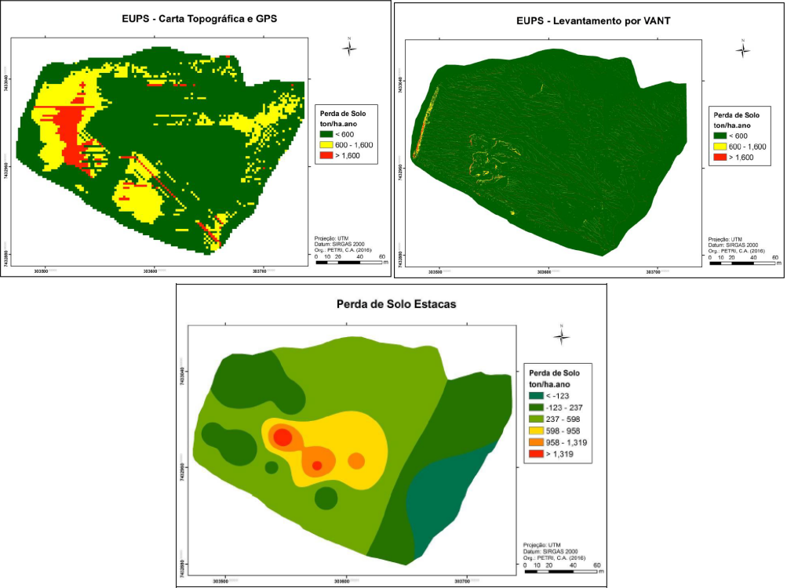
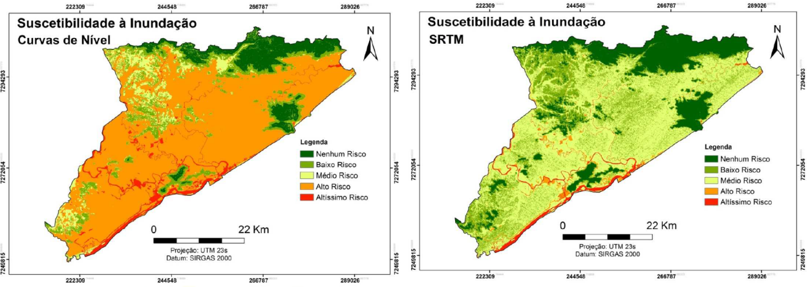
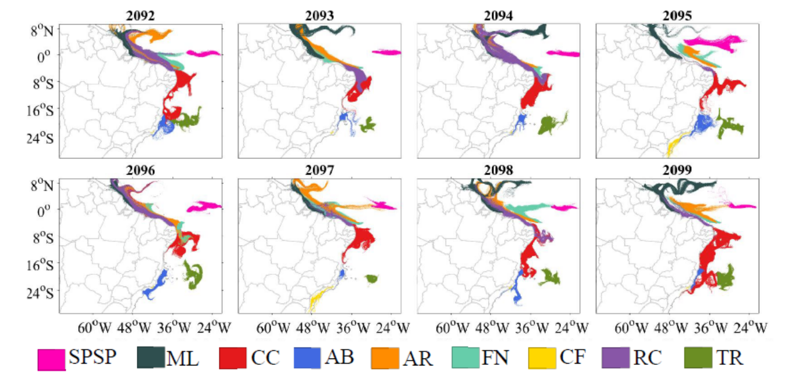
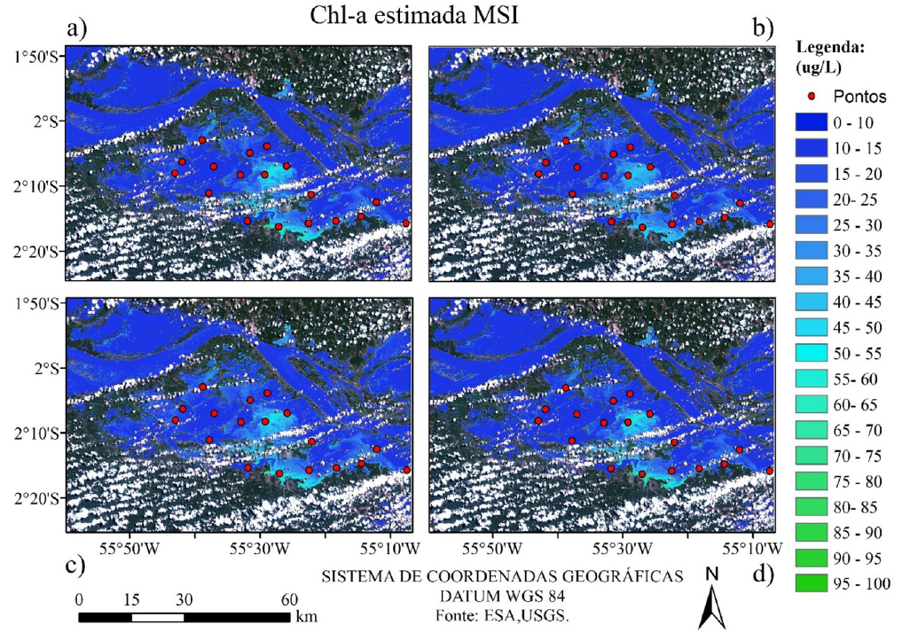
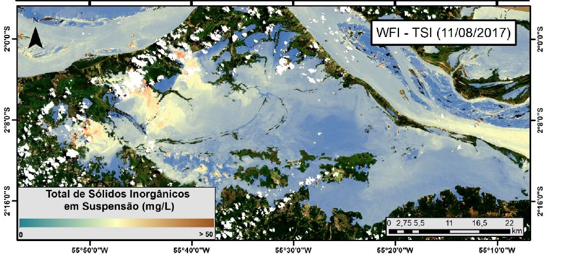

# Para saber mais `r emo::ji("science")`

A seguir são apresentados alguns estudos desenvolvidos no INPE.

## **IMPACTOS DA RESOLUÇÃO ESPACIAL DE MODELOS DIGITAIS DE SUPERFÍCIE NO CÁLCULO DA PERDA DE SOLO ATRAVÉS DA EUPS EM AMBIENTE URBANO**

No presente estudo foram comparados os resultados da aplicação da Equação Universal de Perdas de Solo (EUPS) com o uso de modelos digitais de terreno obtidos através de cartas topográficas na escala 1:10.000 integradas com coleta de pontos por GPS; e também pelo levantamento de um modelo digital de superfície (MDS) por VANT. Os resultados obtidos com os dois métodos foram ainda comparados com uma estimativa de movimentação de solo pela inserção de estacas no terreno, com monitoramento de um ano. 

```{r fig111143, echo=FALSE ,out.width = "100%",fig.align="center",fig.cap='Mapa de Londres com óbitos por cólera (pontos) e poços de água (cruzetas)'}
  
```

Figura \@ref(fig:fig111143) - Estimativa da perda de solo anual derivado de carta topográfica e pontos GPS; derivado de levantamento com VANT; e interpolação da perda de solo monitorada por estacas.

Artigo completo: [Simpósio Brasileiro de Sensoriamento Remoto - SBSR](http://marte2.sid.inpe.br/col/sid.inpe.br/marte2/2017/09.25.14.55/doc/goto/sid.inpe.br/marte2/2017/10.27.15.55.49)


## **CRIAÇÃO E AVALIAÇÃO DE MAPAS DE SUSCETIBILIDADE A INUNDAÇÃO PARA O MUNICÍPIO DE IGUAPE, ESTADO DE SÃO PAULO**

As inundações são os desastres naturais mais frequentes e que causam maiores danos econômicos, sociais e ambientais no mundo. Para este trabalho, entende-se inundação como a elevação do nível de água de um corpo hídrico para além do seu nível normal, alagando a planície aluvial deste corpo. As inundações são causadas devido às características ambientais tais como chuvas, formato da bacia hidrográfica, cobertura vegetal, escoamento superficial; e antrópicas; como a impermeabilização dos solos e o descarte de lixo em locais inadequados.
Para tomar medidas preventivas e planejar possíveis remediações, torna se necessário identificar as áreas do município com maior ou menor possibilidade de inundação. Mapas de suscetibilidade se apresentam como ferramentas fundamentais neste tipo de planejamento. Diferentes métodos podem ser utilizados para elaborar os mapas, trazendo resultados mais ou menos verossímeis. Este trabalho buscou identificar as diferenças ao aplicar o mesmo método de análise de dados em modelos digitais de elevação diferentes, sendo um destes fornecido pelo TopoData (BRASIL, 2011), elaborado a partir de imagens do SRTM (*Shuttle Radar Topography Mission*), e de um modelo digital de elevação em grade elaborado a partir de curvas de nível disponíveis no Sistema de Informações Geográficas do Ribeira de Iguape e Litoral Sul (SIGRB). Pretendeu se assim analisar o impacto de métodos diferentes ao se representar uma mesma área.

```{r fig111144, echo=FALSE ,out.width = "100%", fig.align="center",fig.cap='Mapa de Londres com óbitos por cólera (pontos) e poços de água (cruzetas)'}
  
```

Figura \@ref(fig:fig111144) - Suscetibilidade à inundação para o município de Iguape – SP utilizando curvas de nível (esquerda) e SRTM (direita) como dado topográfico.

Artigo completo: [Revista Gestão \& Sustentabilidade Ambiental](http://www.portaldeperiodicos.unisul.br/index.php/gestao_ambiental/article/view/7276)


## **CONECTIVIDADE DEMOGRÁFICA E ACLIMATAÇÃO DE PEIXES RECIFAIS DO GÊNERO SPARISOMA EM CENÁRIO DE MUDANÇAS CLIMÁTICAS**

As mudanças na circulação e na temperatura do oceano afetam diretamente a capacidade de dispersão e assentamento dos organismos marinhos. Esta influência se dá principalmente nas condições de sobrevivência dos ovos e larvas, assim como na trajetória imposta pela circulação superficial. As projeções de cenários futuros de mudanças climáticas podem resultar em alterações na circulação e temperatura dos oceanos, afetando o ciclo de vida dos organismos marinhos. O objetivo deste trabalho foi determinar os padrões de conectividade demográfica das populações de peixes recifais do gênero Sparisoma sp. das ilhas oceânicas e plataforma continental do Brasil localizadas em Unidades de Conservação Marinhas (UCMs), frente às possíveis alterações ambientais em cenários futuros de mudanças climáticas.

```{r fig111145, echo=FALSE ,out.width = "100%", fig.align="center",fig.cap='Mapa de Londres com óbitos por cólera (pontos) e poços de água (cruzetas)'}
  
```

Figura \@ref(fig:fig111145) - Padrões de dispersão de ovos e larvas de Ichthyop para os verões das simulações horárias nos cenários de aclimatação. Onde: SPSP – Arquipélago de São Pedro e São Paulo; ML – Parcel Manuel Luíz; CC – Costa dos Corais; AB – Abrolhos; AR – Atol das Rocas; FN – Fernando de Noronha; CF – Cabo Frio; RC – Recife de Corais; TR – Ilhas de Trindade e Martim Vaz.

Observou-se que para o final do século XXI, o cenário de mudanças climáticas (RCP 8.5), apresenta aumento da mortalidade e redução da conectividade entre as Unidades de Conservação Marinhas próximas ao equador. A condição de aclimatação frente a um oceano mais quente, reduz significativamente a mortalidade e consequentemente, aumenta a conectividade entre as UCMs, principalmente no verão.

Dissertação completa: [Instituto Nacional de Pesquisas Espaciais (INPE)](http://mtc-m21c.sid.inpe.br/col/urlib.net/www/2017/11.22.19.04.03/doc/mirrorget.cgi?metadatarepository=sid.inpe.br/mtc-m21c/2019/04.05.17.41.55&choice=full&languagebutton=pt-BR)


## **PARAMETRIZAÇÃO DE ALGORITMOS EMPÍRICOS E ALGORITMO QUASI-ANALÍTICO QAA PARA ESTIMATIVA DE CLOROFILA-A EM LAGOS DA VÁRZEA DO RIO AMAZONAS**


O monitoramento sistemático, essencial para a manutenção dos serviços ecossistêmicos, visa auxiliar na gestão, manutenção e recuperação de recursos hídricos diante das ações antrópica. Suplementando as metodologias tradicionais, o sensoriamento remoto (SR) de ambientes aquáticos relaciona as propriedades ópticas e biogequímicas do meio, possibilitando uma visão sinóptica de seus padrões de distribuição no tempo e espaço. A determinação do estado trófico e da produtividade primária do ambiente, estimadas por meioda concentração de clorofila-a (Chl-a). podem ser utilizados como índice da qualidade do recurso hídrico. A quantificação de Chl-a por SR embasa-se na aplicação empírica e/ou semi-analítica de algoritmos, geralmente desenvolvidos para águas oceânicas e costeiras, necessitando assim serem calibrados para sua utilização em águas continentais complexas como às da planície de inundação amazônica. 
Portanto este trabalho teve como objetivo  Estimar a concentração de Chl-a em águas túrbidas de lagos amazônicos a partir da parametrização de algoritmos bióticos (empíricos e semi-analíticos) utilizando dados in situ e posterior validação e espacialização com sua aplicação a imagens de satélite de média/alta resolução atualmente disponíveis, OLI/Landsat-8, MSI/Sentinel-2 e OLCI/Sentinel-3.

```{r fig111146, echo=FALSE ,out.width = "100%", fig.align="center",fig.cap='Algoritmos calibrados com dados in situ especializados para o sensor MSI. Sendo os algoritmos:  a) NDCI (linear), b) NDCI (quadrático), c) 2B-M (linear), d) 3B-M (linear).'}
  
```

Dissertação completa: [Instituto Nacional de Pesquisas Espaciais (INPE)](http://urlib.net/sid.inpe.br/mtc-m21c/2019/03.22.19.03)

## **QUANTIFICAÇÃO REMOTA DA CONCENTRAÇÃO DE SÓLIDOS TOTAIS E INORGÂNICOS EM SUSPENSÃO EM LAGOS DA PLANÍCIE DE INUNDAÇÃO DO BAIXO AMAZONAS - UMA ABORDAGEM MULTI-SENSOR**

A utilização de imagens de sensoriamento remoto é de fundamental importância para aumentar o conhecimento sobre a dinâmica da troca de sedimentos entre o Rio Amazonas e as planícies de inundação já que ela pode ajudar a entender como as mudanças climáticas e de uso da terra influenciam esse processo. Neste sentido, este trabalho investigou a acurácia de algoritmos de estimativa de TSS (Total de Sólidos em Suspensão) e TSI (Total de Sólidos Inorgânicos em suspensão) através da utilização de três sensores de média resolução espacial (Landsat-8/OLI, Sentinel-2A/MSI e CBERS-4/WFI) em lagos na planície de inundação do Baixo Amazonas. Através de simulação Monte Carlo, foram calibrados e validados algoritmos.

```{r fig111147, echo=FALSE ,out.width = "100%", fig.align="center",fig.cap='Mapa de TSI obtidos pelos sensores MSI, OLI e WFI através dos algoritmos empíricos que apresentaram os melhores resultados.'}
  
```

Dissertação completa: [Instituto Nacional de Pesquisas Espaciais (INPE)](http://urlib.net/sid.inpe.br/mtc-m21c/2019/01.30.16.35)


# References